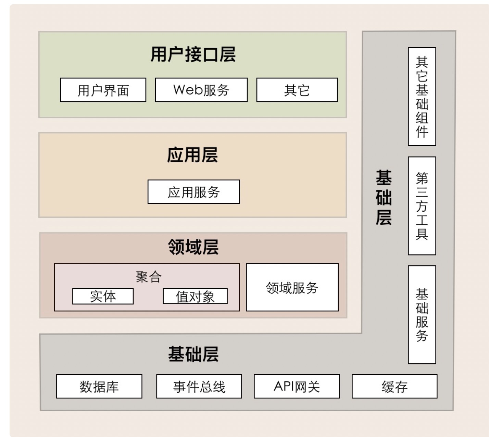

## DDD
### 简述
DDD即领域驱动设计，关于DDD

治理应用复杂度

1:统一语言 ：
2：领域划分。大问题划分为子问题 边界上下文  
3:业务复杂度技术复杂度分离

建模基础：抽象
用例分析
关键名词 动名词 关键信息 抽象出领域核心概念

COLA
业务复杂度（domain层核心要解决的）与技术复杂度分离（基础设施层）
提供应用可维护性。可理解性

保证业务逻辑的纯粹
### interface 
面向前端提供服务适配，这一层聚集了接口适配的相关功能
### application
实现服务组合和编排，适应业务流程快速变化的需求，这一层聚集了应用服务和事件的相关功能

### domain
主要存储领域核心业务逻辑的相关代码，领域层可以包含多个聚合代码包，他们共同实现领域模型的核心业务逻辑。聚合以及聚合体内的实体、方法、领域服务和事件等。

### infrastructure
主要存放基础资源服务的相关代码，为其他各层提供通用技术能力、三方软件包、数据服务、配置和基础资源等等。

