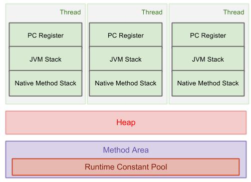

# JVM的各个分区
## 前言
#### 最近在看JVM的书籍，避免看过就忘了。所以想用文字记录一下。本文会讲一下我理解的JVM中的各个分区。
## 正文
#### 现在直接概括一下JVM中到底有哪些分区
- 堆 (线程共享) (GC的主要发生区)
- 栈 (细分为虚拟机栈和本地方法栈) (线程独占) 
- 方法区 (non-heap) (线程共享) (内部还包含了一个运行时常量区)
- 程序计数器 (线程独占)




## 堆
#### 堆是JVM最大的一块区域。主要是用于存储代码中存储的各个对象。由于是虚拟机中分配的最大的一块区域，所以也是GC发生的最主要的区域。
#### 堆内部还可以再划分为Eden区，survivorTo区，survivorFrom区。三个区的大小比例最好是8:1:1。当然这些大小都是可以由用户自主的定义大小。有几个参数可供调配
- -Xmx 堆的最大内存
- -Xms 堆的最小内存

#### 可以看到堆的可以由伸缩范围的，而且在实际的物理内存中，堆可以不是连续的，只要是逻辑连续就可以了。但是若对象分配的总大小已经大过了最大内存。则会报OutOfMemoryError。也就是我们常见的OOM
#### 因为堆中会不停的发生不同程度的GC，由于不同的GC算法的实际方法有所不同。
#### 有采用compact算法的Serial，Parnew的GC，会将堆中空闲的内存块都统一合并成一大块，那么对象在创建分配内存的时候，只需要采用指针碰撞的方法，将符合要求的一块内存块的收尾指针移动一下，就可以看做分配给了新创建的对象。
#### 采用Maek-sweep算法的CMS的GC，只是维护了一个空闲内存块的表格，所以在对象分配的时候直接在表中寻找到一块最适合的分配就行了
#### 以上两种都是非常常见的方式，但是在采用指针碰撞的时候，要注意并发问题。也就是若同时有两个对象内存需要分配，则要注意指针的移动。一般会采用CAS+重试的方式，保证内存分配的无误。也有一种方式是，为每个线程都预先分配一块内存，叫做TLAB，所以每个线程都可以在自己的内存中无措的分配，只有在新分配TLAB的时候才需要错定内存块。


## 栈
#### 栈也是我们在学校学习的时候，经常听到的一个词。但是其实在JVM定义的时候，栈是有两块组成的，一个叫做虚拟机栈，一个叫做本地方法栈。顾名思义我们也可以看出两个的不同就是本地方法栈存储的都是一些native的方法。但是在HotSpot的虚拟机的实现方法中，其实这两块也是合二为一的。
#### 那什么叫做存储的是方法呢？方法又是以什么样是形式存在栈中的呢？
#### 其实存储在栈中的单位叫做栈帧，每个栈帧里面保存的是方法中的局部变量表，操作数，动态链接，方法出口等信息。每个栈帧的入栈表示执行当前方法，出栈表示完成了当前方法。所以当我们在一个方法里递归调用了自己，就会导致不断有新的栈帧入栈，但是没有出栈，就会造成最后达到了栈的最大深度。就会报出StackOverFlowError

## 程序计数器
#### 程序计数器就是每个线程都独有的一个寄存器，记录了每个线程目前执行到了哪个语句，那么当cpu在调度别的线程的时候，能将当前进度保存下来。当再度调度到的时候，也就可以继续之前的工作了

## 方法区
#### 方法区在jdk 1.7中可以类比于永久代。其实按书上所说这两者并不完全相同，只是jvm作者用永久代的实现方式实现了方法区而已。在方法区中存储的主要是类的属性方法，基本不进行GC，因为在这个区内GC的成果很低，因为这些常量不会很经常被卸载。这个方法区中还有一个叫做运行时常量区的地方，我们最常用到这块地方就是我们调用String.intern()方法。这个方法会将这个String作为常量保存在这个运行时常量区内。这边还有关于这个方法的小例子。

```
    public static void main(String[] args) {
        String str1 = new StringBuilder("ab").append("cd").toString();
        System.out.println(str1.intern() == str1);

        String str2 = new StringBuilder("ja").append("va").toString();
        System.out.println(str2.intern() == str2);
    }
```
#### 这个小例子在jdk1.7的版本下运行会返回true，false。但是在jdk1.6版本下运行会出现false，false。这也是因为两个版本的jdk对intern方法实现变量到运行时常量区的方式的不同。具体原理感兴趣的可以参考一下<深入理解java虚拟机>一书的2.4.3小节
## 总结
#### 本文简单叙述了一下我理解的jvm内存格局，里面提到的GC方式，会在下一篇文章中再做叙述。