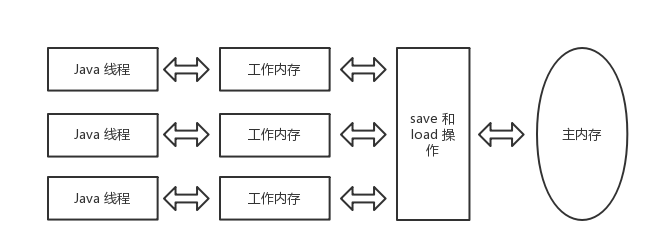
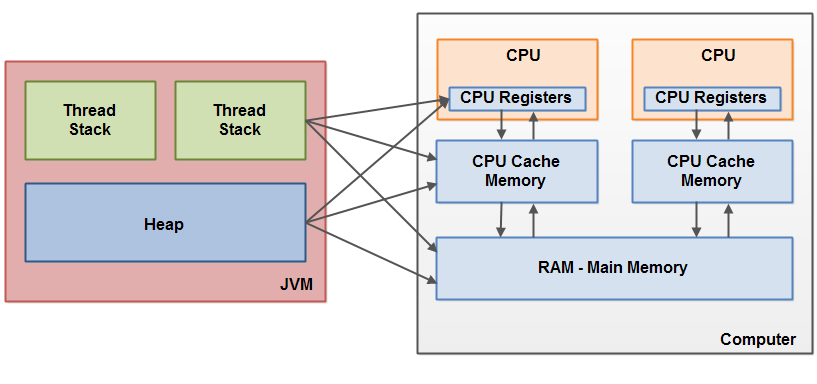
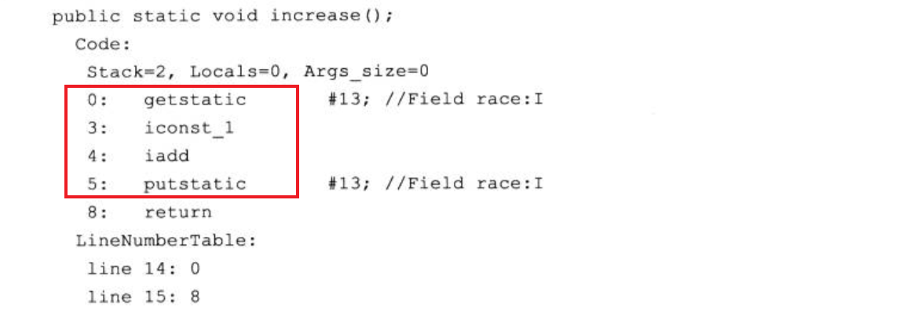

### 一、计算机内存模型

#### 1.1 内存模型


图片来源：[Java Memory Model](http://tutorials.jenkov.com/java-concurrency/java-memory-model.html)

 - 寄存器（registers）：在 CPU 内部，用来存储指令、数据和地址等，是 CPU 可以读写的最快的存储器
 - CPU 缓存（cache）：高速缓冲存储器，在 CPU 内部，一般会分级（L1，L2，L3）
 - 主存（RAM）：一般我们所说的内存条
 - 外部存储器：硬盘（机械硬盘，固态硬盘）和磁盘是同一个意思，硬盘最常见的类型就是磁盘）、U 盘、光盘等

#### 1.2 CPU 读取硬盘数据流程

 1. CPU 将相关的命令和地址，通过系统总线和 IO 总线传递给磁盘，发起一个磁盘读
 2. 磁盘控制器将相关的地址解析，并通过 IO 总线与内存总线将数据传给内存
 3. 第 2 步完成之后，磁盘控制器向 CPU 发送一个中断信号，这时 CPU 就知道了，数据已经发送到内存了

#### 1.3 CPU 多级缓存


图片来源：[与程序员相关的 CPU 缓存知识 ](https://coolshell.cn/articles/20793.html)

### 二、Java 内存模型

#### 2.1 主内存与工作内存



Java 内存模型规定所有的变量都必须存储在主内存中，而每条线程都有自己的工作内存，线程的工作内存中保存了主内存中对象的副本，线程对变量的所有操作都必须在工作内存中进行，而不能直接操作主内存中的变量。

工作内存是线程私有的，而主内存是所有线程共享的部分。

JLS 定义了线程对主存的操作指令：`lock`，`unlock`，`read`，`load`，`use`，`assign`，`store`，`write`。这些行为是不可分解的原子操作，在使用上相互依赖。

 1. lock：作用于主内存，把变量标识为线程独占状态
 2. unlock：作用于主内存，解除独占状态
 3. read：作用主内存，把一个变量的值从主内存传输到线程的工作内存
 4. load：作用于工作内存，把 `read` 操作传过来的变量值放入工作内存的变量副本中
 5. use：作用工作内存，把工作内存当中的一个变量值传给执行引擎
 6. assign：作用工作内存，把一个从执行引擎接收到的值赋值给工作内存的变量
 7. store：作用于工作内存的变量，把工作内存的一个变量的值传送到主内存中
 8. write：作用于主内存的变量，把 `store` 操作传来的变量的值放入主内存的变量中

#### 2.2 Java 内存模型与计算机内存模型之间的关系



图片来源：[Java Memory Model](http://tutorials.jenkov.com/java-concurrency/java-memory-model.html)

JVM 中所有的栈内存与堆内存都在计算机中的 RAM 中，部分堆栈可能在 CPU 的缓存或者寄存器中。

### 三、并发中的三个特性

#### 3.1 原子性

一个或多个操作，要么全部执行且在执行过程中不被任何因素打断，要么全部不执行。

Java 中可以通过`synchronized` 关键字来保证代码的原子性问题。Java 中的运算并非原子操作，竞争条件下操作共享变量，随时会出现线程安全问题。例如一个变量的自增操作，通过反编译会获取到多个操作指令的字节码。



#### 3.2 可见性

可见性的定义常见于各种并发场景中，以多线程为例：当一个线程修改了线程共享变量的值，其它线程能够立即得知这个修改。

Java 内存模型通过变量修改后将值同步回主存，在变量读取前从主内存刷新变量的方式来实现可见性。Java 中能实现可见性的关键字有 `volatile`、`synchronized` 和 `final`。

#### 3.3 有序性

如果在本线程内观察，所有的操作都是有序的，如果在一个线程中观察另一个线程，所有的操作都是无序的，第一句指的是“线程内表现为串行语义”，第二句指“指令重排序”现象和“工作内存与主内存同步延迟”现象。

Java 中可以通过 `volatile` 与 `synchronized` 两个关键字来保证代码的有序性问题。

### 四、指令重排序与 happens-before

#### 4.1 指令重排序

如果指令彼此不依赖，CPU 可以并行执行指令，这个过程中可能会改变指令在代码中的顺序。重排序通常是编译器或运行时环境为了优化程序性能而采取的对指令进行重新排序执行的一种手段。

#### 4.2 happens-before

先行发生原则是 Java 内存模型中定义的两项操作之间的偏序关系，如果说 A 操作先行发生于 B 操作，在 B 操作发生之前，操作 A 产生的影响会被 B 观察到，“影响”包括修改了内存中变量的值、调用了方法、发送了消息等。

Java 内存模型具备一些先天的“有序性”，即不需要通过任何手段就能够得到保证的有序性，这个通常也称为 happens-before 原则。如果两个操作的执行次序无法从 happens-before 原则推导出来，那么它们就不能保证它们的有序性，虚拟机可以随意地对它们进行重排序。

天然的有序性如下：

 - 程序次序规则：一个线程内，按照代码顺序，书写在前面的操作先行发生于书写在后面的操作
 - 锁定规则：一个 lock 操作先行发生于后面对同一个锁额 unlock 操作
 - `volatile` 变量规则：对一个变量的写操作先行发生于后面对这个变量的读操作
 - 传递规则：如果操作 A 先行发生于操作 B，而操作 B 又先行发生于操作 C，则可以得出操作 A 先行发生于操作 C
 - 线程启动规则：`Thread` 对象的 `start()` 方法先行发生于此线程的每个一个动作
 - 线程中断规则：对线程 `interrupt()` 方法的调用先行发生于被中断线程的代码检测到中断事件的发生
 - 线程终结规则：线程中所有的操作都先行发生于线程的终止检测，我们可以通过 `Thread.join()` 方法结束、`Thread.isAlive()` 的返回值手段检测到线程已经终止执行
 - 对象终结规则：一个对象的初始化完成先行发生于他的 `finalize()` 方法的开始

### 五、volatile 关键字

```java
public class TaskRunner {

    private static int number;
    private static boolean ready;

    private static class Reader extends Thread {
        @Override
        public void run() {
            while (!ready) {
                System.out.println("===========");
                Thread.yield();
            }
            if (0 == number) {
                System.err.println(number);
                System.gc();
            } else {
                System.out.println(number);
            }
        }
    }

    public static void main(String[] args) {
        new Reader().start();
        number = 42;
        ready = true;
    }
}
```

上面这段代码除了能正常输出 42 外，还可能输出 0，或者一直等待下去。

 - 输出 0：`number = 42;` 与 `ready = true;` 可能存在重排序，导致 `ready = true;` 先执行，接着 `Reader` 线程执行
 - 一直阻塞：主线程执行 `ready = true;` 后，ready 的值没有被写会主存，`Reader` 线程读不到最新的值

只需要用 `volatile` 修饰 `number` 与 `ready` 字段就能解决上面的问题。`volatile` 关键字的语意是：当一个变量被 `volatile` 修饰后会具有两种特性，第一是保证该变量对所有线程的可见性，另一个是禁止指令重排序优化。

由于 `volatile` 完全可见的特性，只需要把 `ready` 字段用 `volatile` 修饰也能达到同样的效果。

#### 5.1 可见性

被 `volatile` 修饰的变量，对于写操作会立即将变量写到主存中，对于读操作每次都从主存中读取。由于 Java 中的运算并非原子操作，因此并不能保证线程安全。

事实上，当变量加了 `volatile `后，JVM 还会保证完全可见性：
 
 - 如果线程 A 写入一个 `volatile` 变量，之后线程 B 读取该变量，则线程 A 写入该变量之前的所有变量都将对线程 B 可见
 - 如果线程 A 读取一个 `volatile` 变量，则读取该变量之前线程 A 读取的所有变量都会从内存中重新读取

```java
public class MyClass {
    private int years;
    private int months;
    private volatile int days;


    public void update(int years, int months, int days){
        this.years  = years;
        this.months = months;
        this.days   = days;
    }
}
```

`days` 被 `volatile` 修饰，当值被写入 `days` 时，`year` 和 `month` 也会立即被写回主存。

```java
public class MyClass {
    private int years;
    private int months;
    private volatile int days;

    public int totalDays() {
        int total = this.days;
        total += months * 30;
        total += years * 365;
        return total;
    }
}
```

`days` 被 `volatile` 修饰，当读取 `days` 给 `total` 赋值时，`year` 和 `month` 也会从主存中获取。

#### 5.2 禁止指令重排序

`volatile` 关键字禁止指令重排序有两层意思：

 1. 如果读写最初发生在写入 `volatile` 变量之前，则普通变量的读写不能重排序到 `volatile` 变量之后
 2. 如果读写最初发生在读取 `volatile` 变量之后，则普通变量的读写不能重排序到`volatile` 变量之前

```java
public class MyClass{
    public int methodA(){
    // x、y 为非 volatile 变量
    // flag 为 volatile 变量
    x = 2;        // 语句 1
    y = 0;        // 语句 2
    flag = true;  // 语句 3
    x = 4;         // 语句 4
    y = -1;       // 语句 5
    }
}
```

由于 flag 变量为 `volatile` 变量，那么在进行指令重排序的过程的时候，不会将语句 3 放到语句 1、语句 2 前面，也不会讲语句 3 放到语句 4、语句 5 后面。但是要注意语句 1 和语句 2 的顺序、语句 4 和语句 5 的顺序是不作任何保证的。

并且 `volatile` 关键字能保证，执行到语句 3 时，语句 1 和语句 2 必定是执行完毕了的，且语句 1 和语句 2 的执行结果对语句 3、语句 4、语句 5 是可见的。


### 参考：

《深入理解 Java 虚拟机》 周志明 著 <br>

[什么是内存（一）：存储器层次结构 ](https://www.cnblogs.com/yaoxiaowen/archive/2004/01/13/7805661.html) <br>

[Guide to the Volatile Keyword in Java](https://www.baeldung.com/java-volatile) <br>

[为什么寄存器比内存快？](http://www.ruanyifeng.com/blog/2013/10/register.html) <br>

[CPU 与硬盘关系的几点疑问？](https://www.zhihu.com/question/55954313) <br>

[cpu —> 内存—> 硬盘这种方式是不是更慢?](https://www.zhihu.com/question/423243212) <br>

[与程序员相关的 CPU 缓存知识 ](https://coolshell.cn/articles/20793.html) <br>

[Java 并发编程：volatile 关键字解析 ](https://www.cnblogs.com/dolphin0520/p/3920373.html) <br>

[volatile 关键字的作用、原理 ](https://monkeysayhi.github.io/2016/11/29/volatile%E5%85%B3%E9%94%AE%E5%AD%97%E7%9A%84%E4%BD%9C%E7%94%A8%E3%80%81%E5%8E%9F%E7%90%86/) <br>

[一文解决内存屏障 ](https://monkeysayhi.github.io/2017/12/28/%E4%B8%80%E6%96%87%E8%A7%A3%E5%86%B3%E5%86%85%E5%AD%98%E5%B1%8F%E9%9A%9C/) <br>

[聊聊原子变量、锁、内存屏障那点事](http://www.0xffffff.org/2017/02/21/40-atomic-variable-mutex-and-memory-barrier/)
