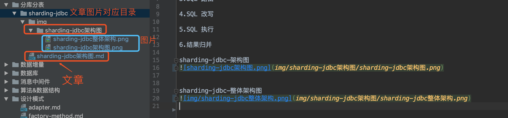

# incubator-technology 简介
&nbsp;&nbsp;&nbsp;&nbsp;&nbsp;&nbsp;&nbsp;为了更好的促进团队的学习技术氛围，更好的同步记录更新学习成果，为新同学提供优质的学习资料，我们决定维护一份优质的技术学习资料。推动大家共同进步。

# 工程模块
**incubator-technology** 技术兴趣小组学习总学习模块 
&nbsp;&nbsp;&nbsp;&nbsp;&nbsp;&nbsp;&nbsp;|   
&nbsp;&nbsp;&nbsp;&nbsp;&nbsp;&nbsp;&nbsp;|—— **基础技术** 
&nbsp;&nbsp;&nbsp;&nbsp;&nbsp;&nbsp;&nbsp;&nbsp;&nbsp;&nbsp;&nbsp;&nbsp;&nbsp;&nbsp;|—— **算法**  
&nbsp;&nbsp;&nbsp;&nbsp;&nbsp;&nbsp;&nbsp;&nbsp;&nbsp;&nbsp;&nbsp;&nbsp;&nbsp;&nbsp;|—— **设计模式**  
&nbsp;&nbsp;&nbsp;&nbsp;&nbsp;&nbsp;&nbsp;&nbsp;&nbsp;&nbsp;&nbsp;&nbsp;&nbsp;&nbsp;|—— **JDK源码解析**  
&nbsp;&nbsp;&nbsp;&nbsp;&nbsp;&nbsp;&nbsp;|   
&nbsp;&nbsp;&nbsp;&nbsp;&nbsp;&nbsp;&nbsp;|—— **RPC** : 远程调用中间件 
&nbsp;&nbsp;&nbsp;&nbsp;&nbsp;&nbsp;&nbsp;&nbsp;&nbsp;&nbsp;&nbsp;&nbsp;&nbsp;&nbsp;|—— **DUBBO**: 一款高性能Java RPC框架  
&nbsp;&nbsp;&nbsp;&nbsp;&nbsp;&nbsp;&nbsp;|  
&nbsp;&nbsp;&nbsp;&nbsp;&nbsp;&nbsp;&nbsp;|—— **消息中间件**: 消息中间件 
&nbsp;&nbsp;&nbsp;&nbsp;&nbsp;&nbsp;&nbsp;&nbsp;&nbsp;&nbsp;&nbsp;&nbsp;&nbsp;&nbsp;|—— **RocketMQ**: 消息中间件  
&nbsp;&nbsp;&nbsp;&nbsp;&nbsp;&nbsp;&nbsp;|  
&nbsp;&nbsp;&nbsp;&nbsp;&nbsp;&nbsp;&nbsp;|—— **分布式**: 分布式相关文档  
&nbsp;&nbsp;&nbsp;&nbsp;&nbsp;&nbsp;&nbsp;&nbsp;&nbsp;&nbsp;&nbsp;&nbsp;&nbsp;&nbsp;|—— **ZK**: 分布式注册中心 Zookeeper  
&nbsp;&nbsp;&nbsp;&nbsp;&nbsp;&nbsp;&nbsp;|  
&nbsp;&nbsp;&nbsp;&nbsp;&nbsp;&nbsp;&nbsp;|—— **数据库** : 关系型数据库和非关系型数据库 
&nbsp;&nbsp;&nbsp;&nbsp;&nbsp;&nbsp;&nbsp;&nbsp;&nbsp;&nbsp;&nbsp;&nbsp;&nbsp;&nbsp;|—— **mysql**: mysql数据库  
&nbsp;&nbsp;&nbsp;&nbsp;&nbsp;&nbsp;&nbsp;&nbsp;&nbsp;&nbsp;&nbsp;&nbsp;&nbsp;&nbsp;|—— **redis**: 分布式缓存 redis  
&nbsp;&nbsp;&nbsp;&nbsp;&nbsp;&nbsp;&nbsp;|  
&nbsp;&nbsp;&nbsp;&nbsp;&nbsp;&nbsp;&nbsp;|—— **分库分表**: 关于分库分表的中间件  
&nbsp;&nbsp;&nbsp;&nbsp;&nbsp;&nbsp;&nbsp;&nbsp;&nbsp;&nbsp;&nbsp;&nbsp;&nbsp;&nbsp;|—— **sharding-jdbc**: 分布式注册中心 Zookeeper  
&nbsp;&nbsp;&nbsp;&nbsp;&nbsp;&nbsp;&nbsp;|  
&nbsp;&nbsp;&nbsp;&nbsp;&nbsp;&nbsp;&nbsp;|—— **数据增量**: 数据增量中间件  
&nbsp;&nbsp;&nbsp;&nbsp;&nbsp;&nbsp;&nbsp;&nbsp;&nbsp;&nbsp;&nbsp;&nbsp;&nbsp;&nbsp;|—— **canal**: mysql数据库binlog的增量订阅&消费组件  
&nbsp;&nbsp;&nbsp;&nbsp;&nbsp;&nbsp;&nbsp;|  

# 文档规范
1.文档中图片上传要求

&nbsp;&nbsp;&nbsp;&nbsp;&nbsp;&nbsp;&nbsp;目前有很多同学文章里面的图片丢失，因此对图片上传做如下要求：

- 在自己文件夹下面创建一个 image 目录，里面存放你需要上传的图片，图片要求，每一张图片都得有 **图片名称**，每篇文章图片一个目录，放在对应image下。如下图：

- 大家也可以将自己的图片上传到公司图片服务器获取第三方云存储平台，然后拿到访问路径即可，如下图，上传到简书中。

公司图片服务器上传地址：http://upload.2dfire.net/utils/page/upload.html

**建议第二种方式，采用第一种方式会使我们的项目越来越大，加载很费劲。**

2.附件上传要求

大家如果需要上传附件，那么直接在自己文件夹下创建一个 attachment 文件夹，大家可以把附件放在该文件夹下，命名一定要明确。然后在自己的文章里面链接过来即可。

gitlab 成效图：直接下载即可

