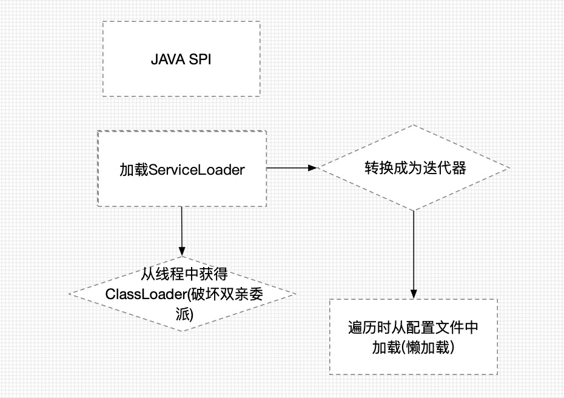
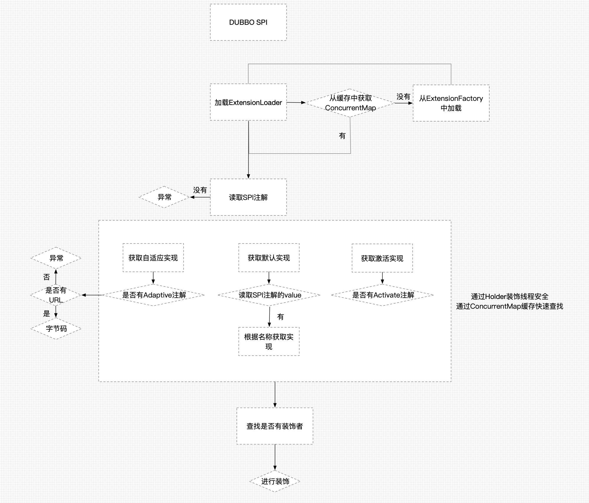

# Dubbo SPI 机制

## 什么是SPI
> * SPI 全称为 (Service Provider Interface) ,是JDK内置的一种服务提供发现机制。 目前有不少框架用它来做服务的扩展发现， 简单来说，它就是一种动态替换发现的机制， 举个例子来说， 有个接口，想运行时动态的给它添加实现，你只需要添加一个实现。

> * 具体是在JAR包的"src/META-INF/services/"目录下建立一个文件，文件名是接口的全限定名，文件的内容可以有多行，每行都是该接口对应的具体实现类的全限定名.

## 在哪些地方使用SPI
> * 不同厂商的JDBC驱动
> * Java的日志框架等等

## JDK SPI示例
定义一个接口

``` JAVA
public interface TestService {
    void sayHello();
}
```
编写该接口的多个实现

* 实现1

``` JAVA
public class PresellService implements TestService {
    @Override
    public void sayHello() {
        System.out.println("test presell");
	}
}
```
* 实现2

``` JAVA
public class HelloService implements TestService {
    @Override
    public void sayHello() {
        System.out.println("test hello");
    }
}
```
* 在META/services下面新建文件 名为接口完整路径 配置该接口的实现

```JAVA
com.presell.dubbo.spi.java.spi.impl.HelloService
com.presell.dubbo.spi.java.spi.impl.PresellService
```

* 运行

``` JAVA
public class App {
    public static void main(String[] args) {
        ServiceLoader<TestService> services = ServiceLoader.load(TestService.class);
        //获取迭代器
        Iterator<TestService> driversIterator = services.iterator();
        //遍历所有的驱动实现
        while(driversIterator.hasNext()) {
            driversIterator.next().sayHello();
        }
    }
```
* 运行结果

```JAVA
test hello
test presell
```
> * 可以看到通过JDK内置SPI 可以将配置的两个实现类都执行了 此处可以根据自己的需求来进行配置 对于程序是无入侵的

## JDK SPI的实现原理
* 依赖ServiceLoader
* 根据ServiceLoader 简单地画了一个执行图


## JDK SPI的不足
* 查找一个具体的实现需要遍历查找，耗时；
* Collection相较于Map差的地方，map可以直接根据key来获取具体的实现,Dubbo SPI在此基础上做了优化
* 每个类都要实现资源浪费


## Dubbo SPI
* JDK标准的SPI会一次性实例化所有实现,如果有的拓展不需要既浪费资源,又很耗时
* 如果扩展点加载失败，连扩展点的名称都拿不到了。比如：JDK标准的ScriptEngine，通过getName();获取脚本类型的名称，但如果RubyScriptEngine因为所依赖的jruby.jar不存在，导致RubyScriptEngine类加载失败，这个失败原因被吃掉了，和ruby对应不起来，当用户执行ruby脚本时，会报不支持ruby，而不是真正失败的原因。
* 增加了对扩展点IoC和AOP的支持
* 采用ConcurrentMap做缓存,/META-INF/dubbo/中配置文件以键值对形式存储,便于加载

```JAVA
dubbo=com.presell.dubbo.spi.dubbo.spi.TestDubbo
spring=com.presell.dubbo.spi.dubbo.spi.TestSpring
world=com.presell.dubbo.spi.dubbo.spi.TestWorld
```

## Dubbo SPI的核心类
* 要想对Dubbo SPI机制有个深入的了解 需要仔细阅读源码 这里列举几个核心的类
* ExtensionLoader SPI核心加载器
* SPI 用于标记是否是SPI接口
* Adaptive 用于标记是否是SPI的自适应实现类/方法
* Activate 用于标记是否是可以激活的实现类/方法 用于对过滤和分组
* Holder类 对于要加载的类做一层装饰,保证线程安全

## Dubbo SPI 执行流程
* 由于ExtensionLoader中执行比较绕,这里根据ExtensionLoader的执行流程画了一个流程图供大家参考,具体信息还需要大家根据自己跟进源码,进一步深入理解


