## Dubbo-集群容错全局分析

1. 在集群调用失败时，Dubbo提供了多种容错方案，缺省为failover重试，下图为集群容错架构图
    
2. 节点关系
    1. 这里的 Invoker 是 Provider 的一个可调用 Service 的抽象，Invoker 封装了 Provider 地址及 Service 接口信息
    2. Directory 代表多个 Invoker，可以把它看成 List<Invoker> ，但与 List 不同的是，它的值可能是动态变化的，比如注册中心推送变更
    3. Cluster 将 Directory 中的多个 Invoker 伪装成一个 Invoker，对上层透明，伪装过程包含了容错逻辑，调用失败后，重试另一个
    4. Router 负责从多个 Invoker 中按路由规则选出子集，比如读写分离，应用隔离等
    5. LoadBalance 负责从多个 Invoker 中选出具体的一个用于本次调用，选的过程包含了负载均衡算法，调用失败后，需要重选
3. Cluster扩展点实现
    1. Failover-Cluster
    2. Failfast-Cluster：快速失败，只发起一次调用，失败立即报错。通常用于非幂等性的写操作，比如新增记录。
    3. Failsafe-Cluster：失败安全，出现异常时，直接忽略。通常用于写入日志等操作。
    4. Failback-Cluster：失败自动恢复，后台记录失败请求，定时重发。通常用于消息通知操作。
    5. Forking-Cluster：并行调用多个服务器，只要一个成功即返回。通常用于实时性要求较高的读操作，但需要浪费更多服务资源。可通过 forks="2" 来设置最大并行数
    6. Broadcast Cluster：广播调用所有提供者，逐个调用，任意一台报错则报错 。通常用于通知所有提供者更新缓存或日志等本地资源信息。
4. 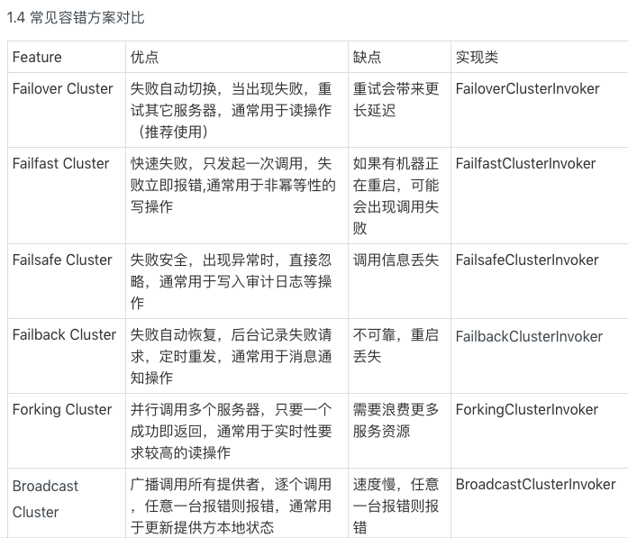
5. 调用链路分析
    1. 从调用方service-consumer开始
        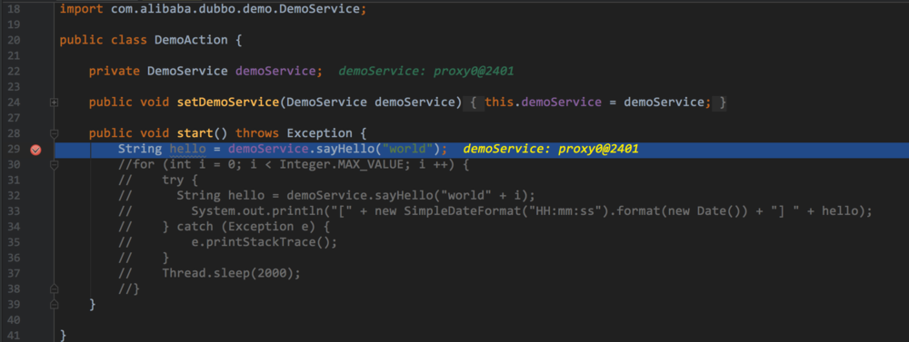
    2. 接着自然是到了代理类的invoke方法里,从图中我们也可以看出,他用的是jdk的动态代理
        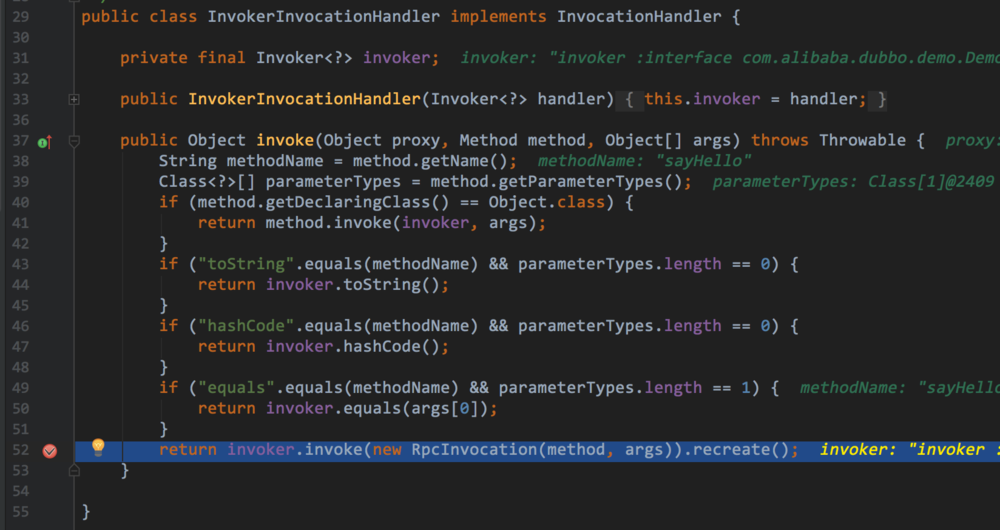
    3. 我们抵达MockClusterInvoker这个类
        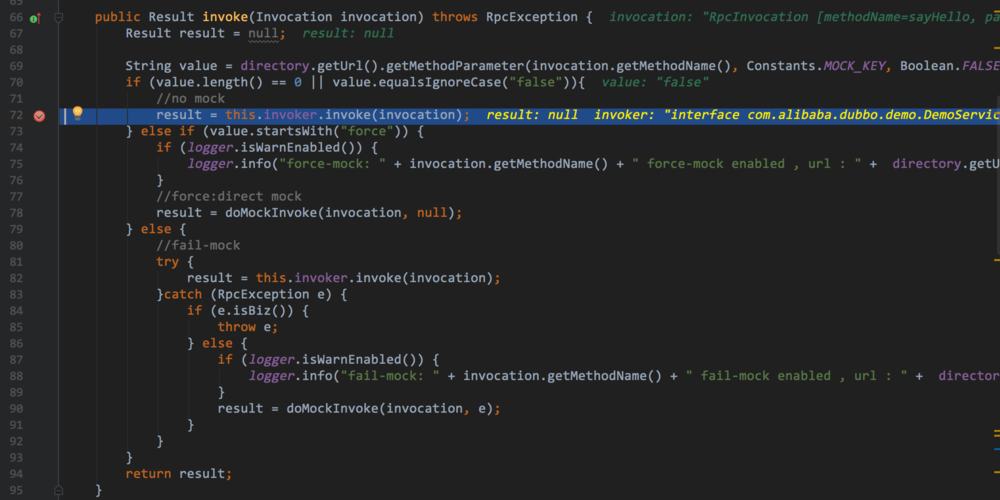
    4. 执行invoke方法就要开始进入到集群，核心方法就是list
        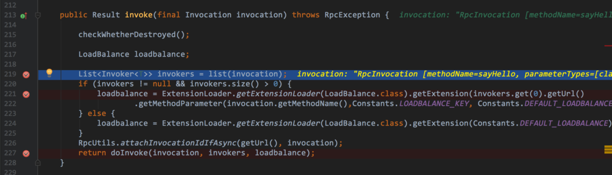
        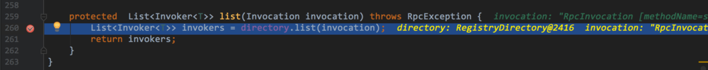
        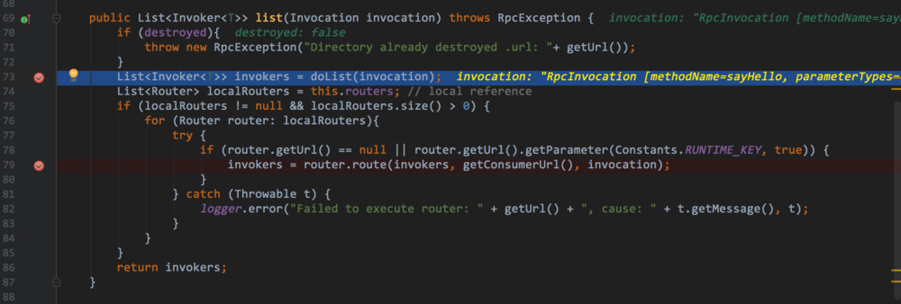
    5. 现在到了AbstractDirectory(上面list方法中doList方法)
        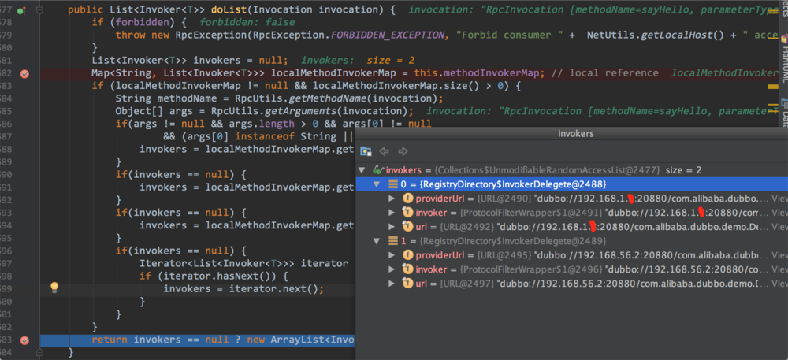
    6. Router过滤
        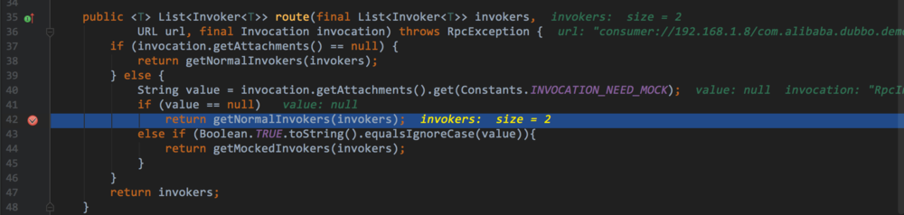
        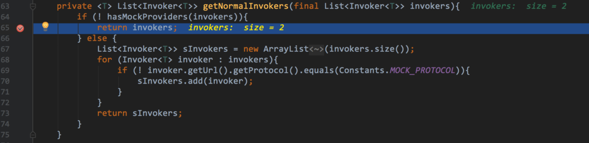
    7. 从ExtensionLoader中拿到LoadBalance
    8. 最后根据容错类子类对象做不同的doInvoke方法
6. 总结
    1. 容错机制中出现了三个词，Directory、Router、LoadBalance，这也是Dubbo的三个核心类，基于这三个类做了不同的容错模式扩展
    2. Dubbo做了几件事
        1. 从Directory中找出本次集群的全部Invokers
        2. 在根据Router的router方法挑选正常执行的Invokers
        3. 然后基于LoadBalance，将上面挑选的正常Invokers中基于配置的负载均衡策略挑出需要执行的Invoker
## Dubbo-集群容错类

1. Dubbo集群下的调用链路
    
2. UML类图
    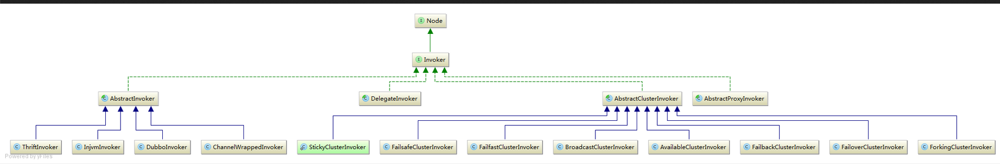
3. AbstractClusterInvoker源码解析
    1. 类结构
        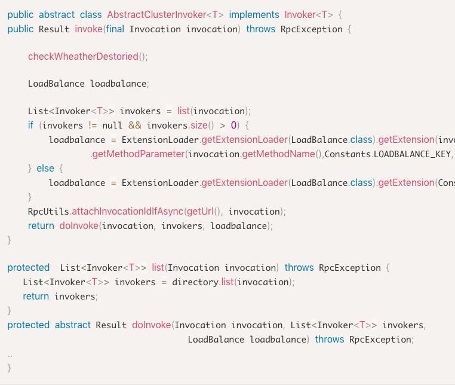
    2. 父类结构解析
        1. 这个类是抽象类
        2. 实现了Invoker接口
            ``` java
                Class<T> getInterface();
                Result invoke(Invocation invocation) throws RpcException;
            ```
        3. invoker方法（通用模板）、真正执行逻辑为doInvoke方法
        4. 其他方法解析
            1. select（粘滞机制，sticky；这个方法真正执行由doSelect方法）
              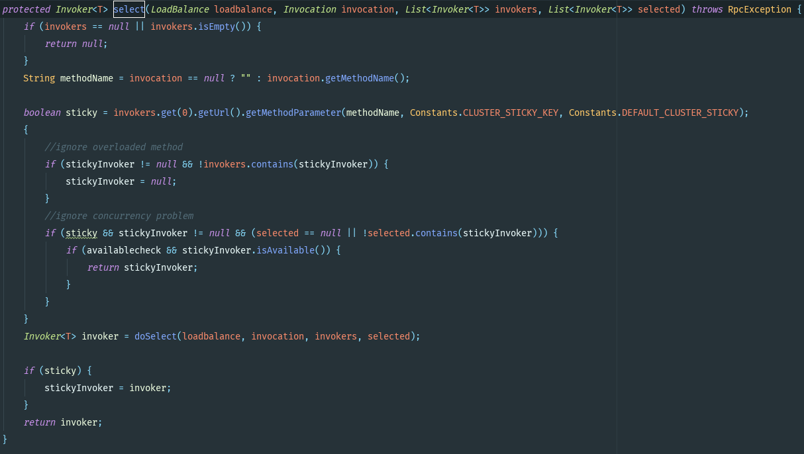 
            2. doSelect（真正执行选取Inovker）
              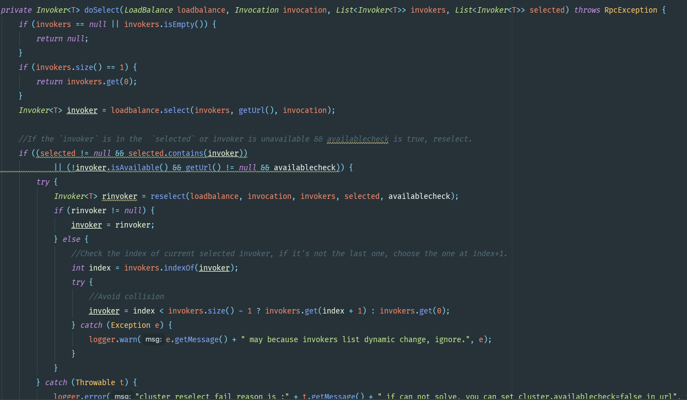
                1. 判断InvokerList集合空和Null情况
                2. 判断size==1情况
                3. 负载均衡策略选择一个Invoker
                4. 判断selected集合Null且selected包含上面选择的invoker或者invoker不可用
                5. 如果上面判断true则重选
                6. 判断重选的invoker是否为null，如果为空，则选择最早的负载均衡的invoker后面或者InvokerList第一个invoker（根据这个Invoker的index是否<invokers.size()-1）
            3. reselect
                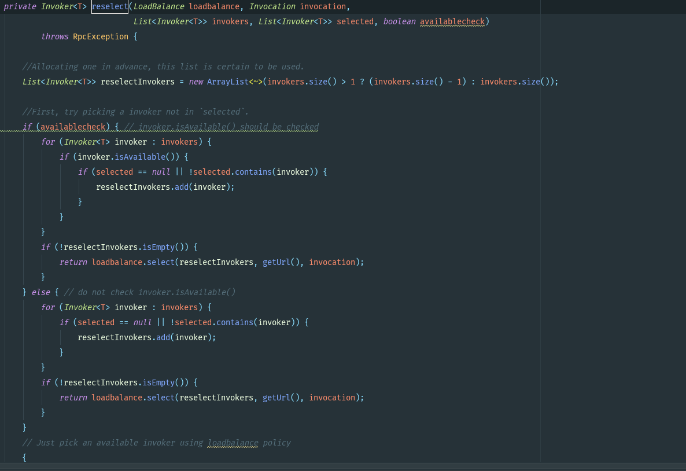
4. 子类源码分析
    1. FailoverClusterInvoker（遍历）
        1. 逻辑整理
            - select()方法拿到所有Invokers，并进行checkInvokers()，这个方法判断了List<Invoker<T>>是否null和list.size()==0
            - 拿到代理类中invocation的methodName
            - 拿到url中的methodName中的重试次数
            - 记录invoked的Inovkers
            - 定义一个set记录Providers
            - 遍历重试次数，直到调用成功返回result，如果遍历完成都没有调用成功…抛出RpcException调用方法失败
             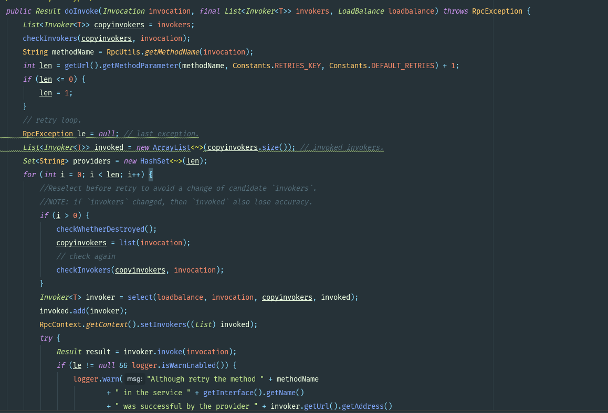
            - 注意点
                - 在失败重试时，避免invokers改变
                - 如果列表发生改变，那么invoked判断会失效
    2. FailfastClusterInvoker（只调用一次）
        1. 逻辑整理
            - checkInovkers()，检查invokers是否为Null和size是否为0
            - select方法选择一个Invoker
            - 然后调用invoke方法执行真实服务代码，如果出现失败则立刻抛出Rpc异常
            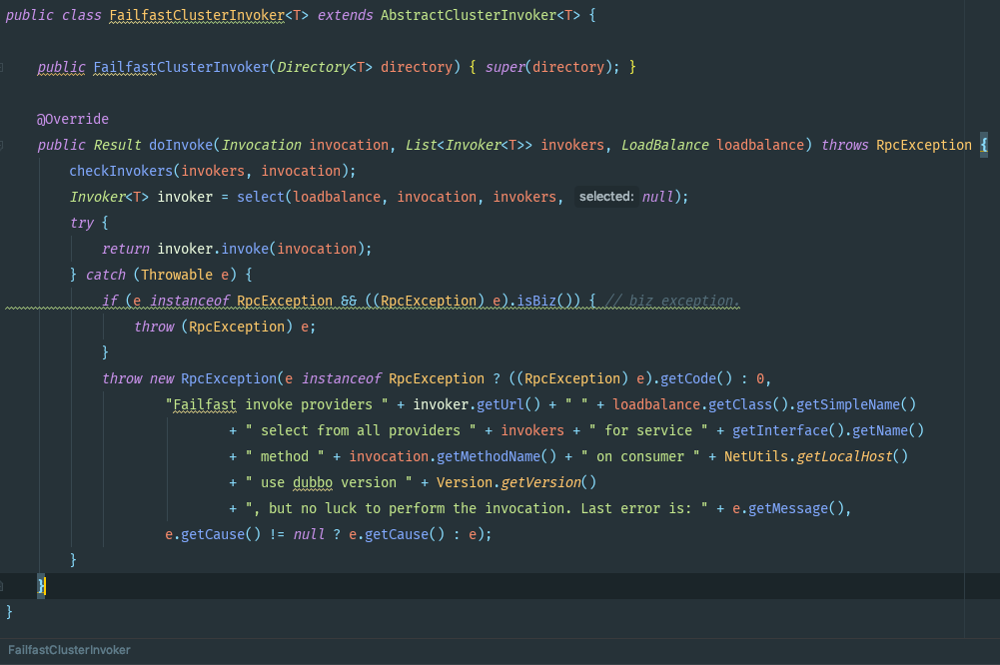
    3. FailsafeClusterInvoker（只调用一次）
        1. 逻辑整理
            - checkInovkers()，检查invokers是否为Null和size是否为0
            - select方法选择一个Invoker
            - 然后调用invoke方法执行真实服务代码，如果执行过程中出现异常，则打印日志并且返回一个全新的RpcResult，但这里不包含（这个Result类包含result和value和exception）,给上游调用方返回一个友好的结果
            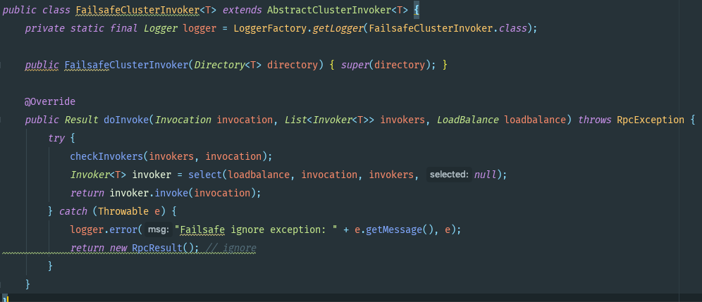