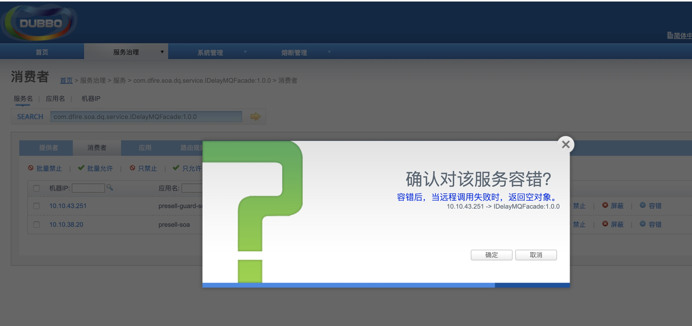
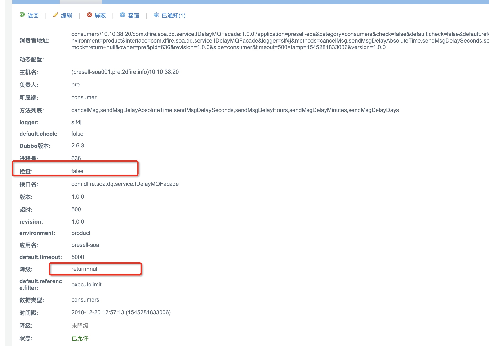
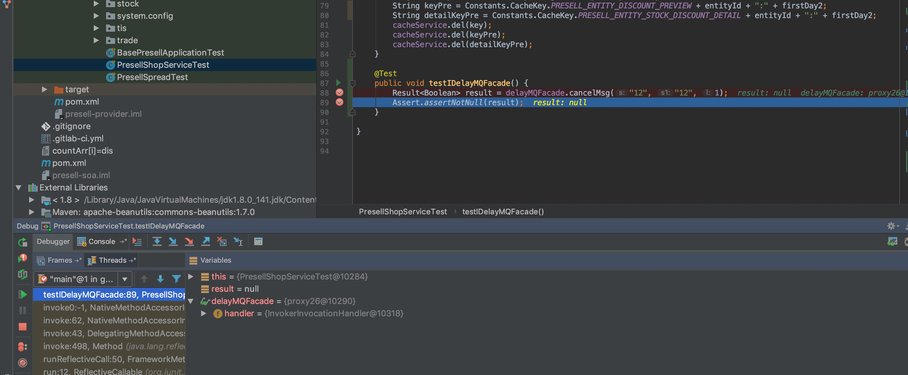
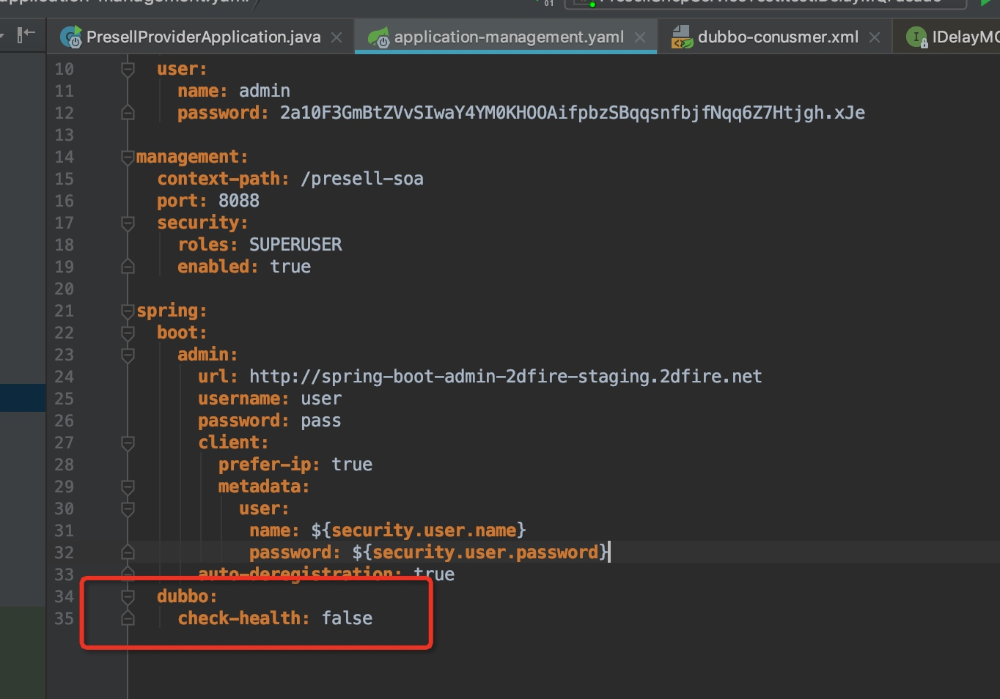
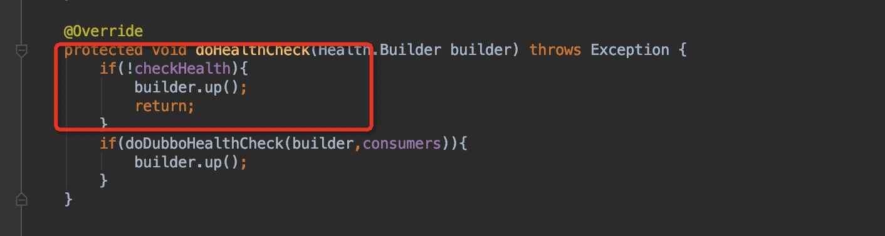
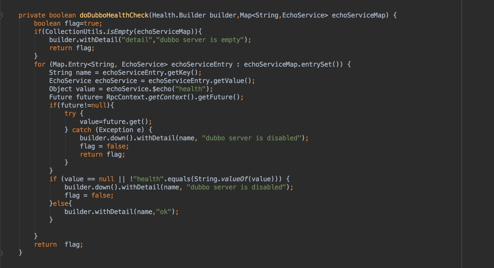
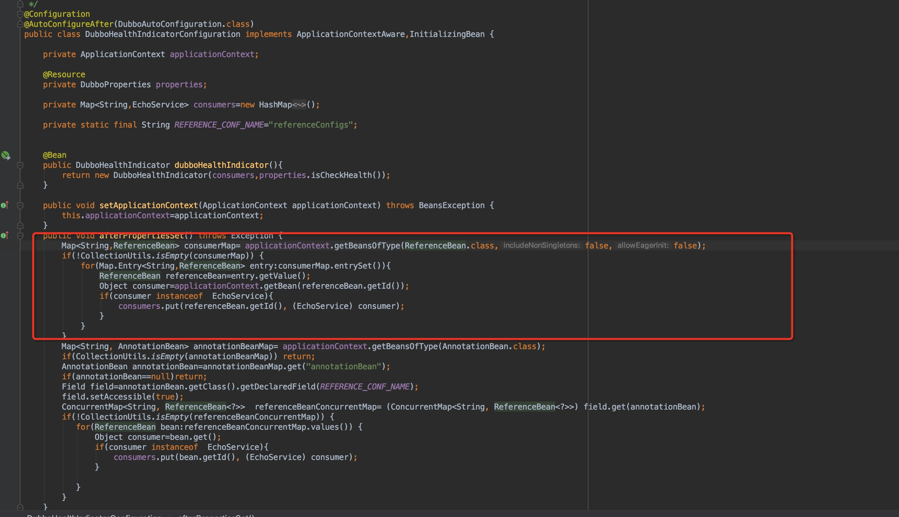
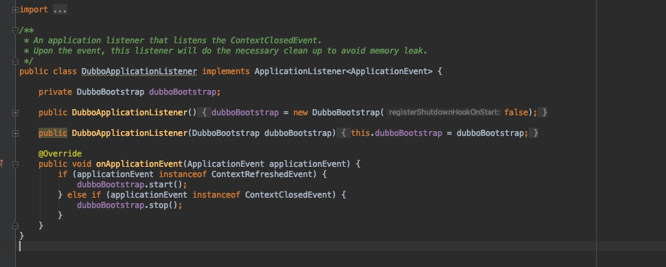
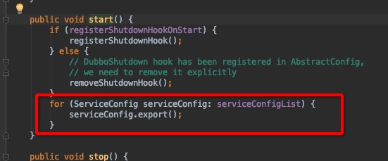

# 服务降级

> 在进行dubbo服务调用时可能会由于各种原因导致服务调用失败（RpcException）
dubbo服务降级就是指在由于非业务异常导致的服务不可用时，可以返回默认值，避免异常影响主业务的处理。

##dubbo服务降级
dubbo 本省就提供了服务降级方案：在消费着配置 check=false 并使用mock 即可在服务不可用的时候返回null，如下图：

或者在dubbo monitor里配置：

配置后dubbo monitor 如下

来看看调用不可用服务dubbo返回的结果

所以同志们不要以为soa层一定会返回东西，空指针老老实实处理掉

##关于check health 失败导致服务告警的降级方案

DubboHealthIndicator 处理这个逻辑很简单

如果没有配置，会从bean服务提取此服务，拿不到就报服务不可用异常

如何获取dubb服务的bean？

dubbo的bean又是如何被发现服务不可用呢

实现了ApplicationListener的类都会被动态通知

start方法做了服务暴露（剩下的就是服务暴露原理，此处不讲）