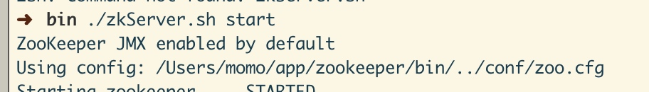
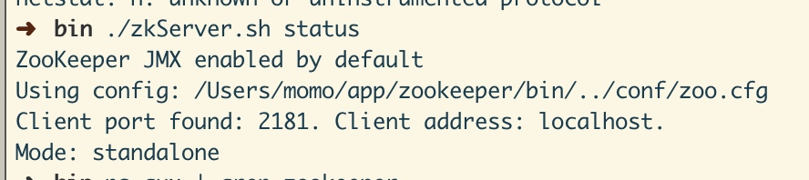
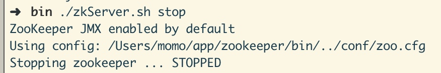
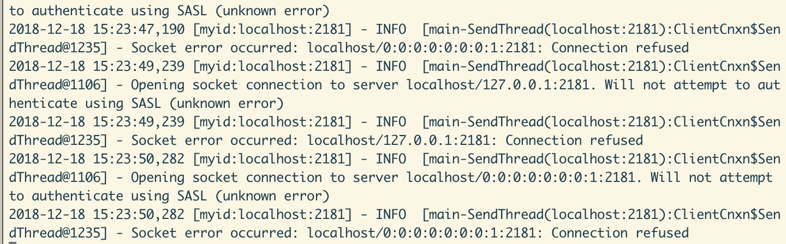
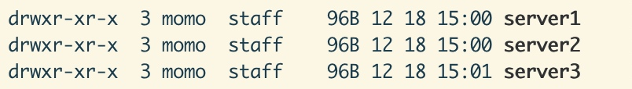

# zookeeper服务搭建
官网下载zookeeper ，解压到指定目录后修改或复制 zoo_sample.cfg zoo.cfg 内容如下
```
# The number of milliseconds of each tick
tickTime=2000
# The number of ticks that the initial
# synchronization phase can take
initLimit=10
# The number of ticks that can pass between
# sending a request and getting an acknowledgement
syncLimit=5
# the directory where the snapshot is stored.
# do not use /tmp for storage, /tmp here is just
# example sakes.
dataDir=/tmp/zookeeper
dataLogDir=/tmp/zookeeper/log
# the port at which the clients will connect
clientPort=2181
# the maximum number of client connections.
# increase this if you need to handle more clients
#maxClientCnxns=60
#
# Be sure to read the maintenance section of the
# administrator guide before turning on autopurge.
#
# http://zookeeper.apache.org/doc/current/zookeeperAdmin.html#sc_maintenance
#
# The number of snapshots to retain in dataDir
#autopurge.snapRetainCount=3
# Purge task interval in hours
# Set to "0" to disable auto purge feature
#autopurge.purgeInterval=1
admin.serverPort=9999
```
#单机模式
进入bin目录下执行：
###启动zookeeper
`./zkServer.sh start`


###检查是否启动成功：
`./zkServer.sh status `

通过上图，我们可以很明显的看到zookeeper监听的是TCP的2181端口，是以standalone单机模式运行的，而且通过zookeeper日志也可以看到目前zookeeper是正常运行的。
###连接服务：
`./zkCli.sh -server localhost:2181`
会出现一堆信息，表明连接成功


###停止服务：
`./zkServer.sh stop`

停掉后客户端会一直报连接失败错误


## 伪集群模式
搭建集群模式时一定要停掉zk服务。
在conf 目录下创建三个 文件：
zoo1.cfg
```
tickTime=2000
initLimit=10
syncLimit=5
dataDir=/Users/momo/app/zookeeper/tmp/data/server1
dataLogDir=/Users/momo/app/zookeeper/tmp/log/server1
clientPort=2182
server.1=localhost:2888:3888
server.2=localhost:2889:3889
server.3=localhost:2890:3890
```
zoo2.cfg
```tickTime=2000
initLimit=10
syncLimit=5
dataDir=/Users/momo/app/zookeeper/tmp/data/server2
dataLogDir=/Users/momo/app/zookeeper/tmp/log/server2
clientPort=2182
server.1=localhost:2888:3888
server.2=localhost:2889:3889
server.3=localhost:2890:3890
```
zoo3.cfg

```
tickTime=2000
initLimit=10
syncLimit=5
dataDir=/Users/momo/app/zookeeper/tmp/data/server3
dataLogDir=/Users/momo/app/zookeeper/tmp/log/server3
clientPort=2182
server.1=localhost:2888:3888
server.2=localhost:2889:3889
server.3=localhost:2890:3890
```
分别在每个实例的dataDir下创建对应的myid文件。

启动这3个ZooKeeper实例
```
./zkServer.sh start ../conf/zoo1.cfg
./zkServer.sh start ../conf/zoo2.cfg
./zkServer.sh start ../conf/zoo3.cfg
```
##集群模式
伪集群都搭好了，集群搭不好么～～～