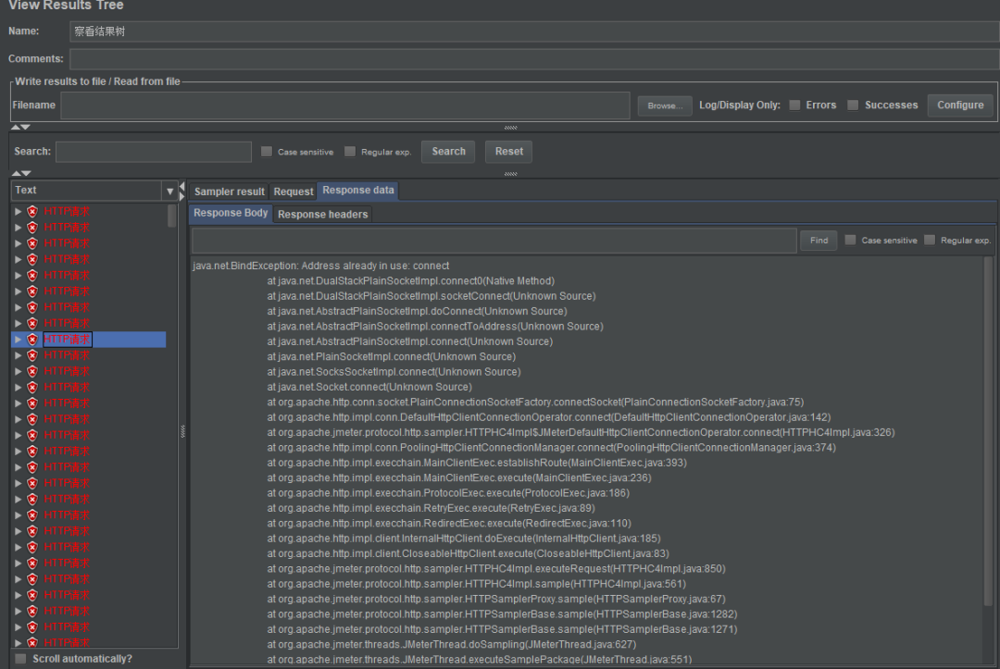
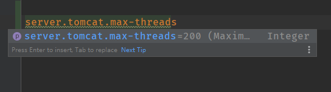
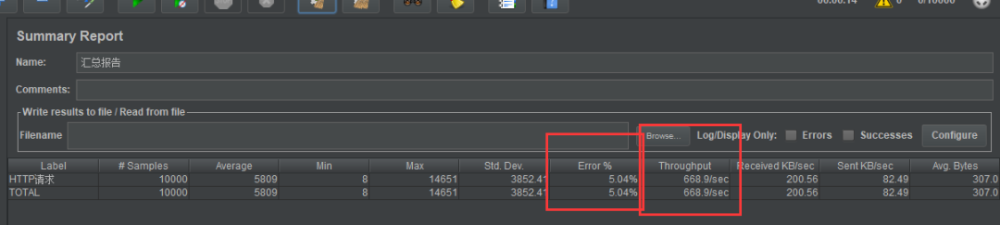
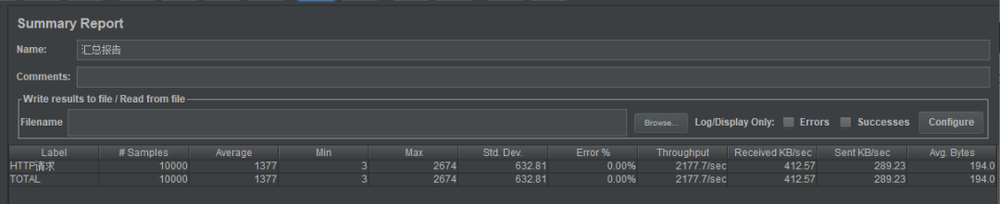
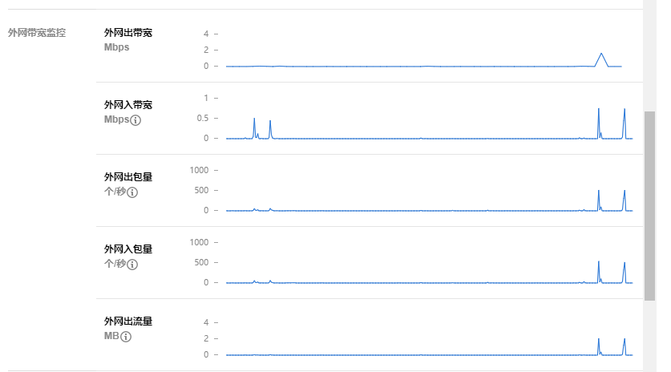
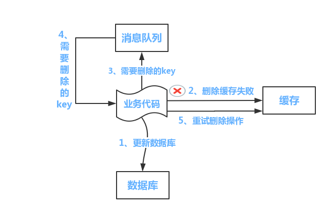

### 缓存与数据库一致性问题剖析


当我们在做数据库与缓存数据同步时，究竟更新缓存，还是删除缓存，究竟是先操作数据库，还是先操作缓存？本文带大家深度分析数据库与缓存的双写问题，以供大家参考。

#### 数据缓存

在我们实际的业务场景中，一定有很多需要做数据缓存的场景，比如售卖商品的页面，包括了许多并发访问量很大的数据，它们可以称作是是“热点”数据，这些数据有一个特点，
就是**更新频率低，读取频率高**，这些数据应该尽量被缓存，从而减少请求打到数据库上的机会，减轻数据库的压力。

##### 为何要使用缓存

缓存是为了追求“快”而存在的。我们用代码举一个例子。

我在自己的Demo代码仓库中增加了两个查询库存的接口getStockByDB和getStockByCache，分别表示从数据库和缓存查询某商品的库存量。

随后我们用JMeter进行并发请求测试。（JMeter的使用请参考我之前写的文章：[点击这里](https://mp.weixin.qq.com/s?__biz=MzU1NTA0NTEwMg==&mid=2247484174&idx=1&sn=235af7ead49a7d33e7fab52e05d5021f&lang=zh_CN&scene=21#wechat_redirect)）

> 需要声明的是，我的测试并不严谨，只是作对比测试，不要作为实际服务性能的参考。

这是两个接口的代码：
```
/**
 * 查询库存：通过数据库查询库存
 * @param sid
 * @return
 */
@RequestMapping("/getStockByDB/{sid}")
@ResponseBody
public String getStockByDB(@PathVariable int sid) {
    int count;
    try {
        count = stockService.getStockCountByDB(sid);
    } catch (Exception e) {
        LOGGER.error("查询库存失败：[{}]", e.getMessage());
        return "查询库存失败";
    }
    LOGGER.info("商品Id: [{}] 剩余库存为: [{}]", sid, count);
    return String.format("商品Id: %d 剩余库存为：%d", sid, count);
}

/**
 * 查询库存：通过缓存查询库存
 * 缓存命中：返回库存
 * 缓存未命中：查询数据库写入缓存并返回
 * @param sid
 * @return
 */
@RequestMapping("/getStockByCache/{sid}")
@ResponseBody
public String getStockByCache(@PathVariable int sid) {
    Integer count;
    try {
        count = stockService.getStockCountByCache(sid);
        if (count == null) {
            count = stockService.getStockCountByDB(sid);
            LOGGER.info("缓存未命中，查询数据库，并写入缓存");
            stockService.setStockCountToCache(sid, count);
        }
    } catch (Exception e) {
        LOGGER.error("查询库存失败：[{}]", e.getMessage());
        return "查询库存失败";
    }
    LOGGER.info("商品Id: [{}] 剩余库存为: [{}]", sid, count);
    return String.format("商品Id: %d 剩余库存为：%d", sid, count);
}
```
首先设置为10000个并发请求的情况下，运行JMeter，结果首先出现了大量的报错，10000个请求中98%的请求都直接失败了。让人很慌张~

打开日志，报错如下：


SpringBoot内置的Tomcat最大并发数搞的鬼，其默认值为200，对于10000的并发，单机服务实在是力不从心。当然，你可以修改这里的并发数设置，但是你的小机器仍然可能会扛不住。



将其修改为如下配置后，我的小机器才在通过缓存拿库存的情况下，保证了10000个并发的100%返回请求：

> server.tomcat.max-threads=10000
>
> server.tomcat.max-connections=10000

可以看到，不使用缓存的情况下，吞吐量为668个请求每秒：


使用缓存的情况下，吞吐量为2177个请求每秒：


在这种**十分不严谨**的对比下，有缓存对于一台单机，性能提升了3倍多，如果在多台机器，更多并发的情况下，由于数据库有了更大的压力，缓存的性能优势应该会更加明显。

测完了这个小实验，我看了眼我挂着 MySQL 的小水管腾讯云服务器，生怕他被这么高流量搞挂。这种突发的流量，指不定会被检测为异常攻击流量呢~



我用的是腾讯云服务器1C4G2M，活动买的，很便宜。这里打个免费的广告，请腾讯云看到后联系我给我打钱 ;)


##### 哪类数据适合缓存

缓存量大但又不常变化的数据，比如详情，评论等。对于那些经常变化的数据，其实并不适合缓存，一方面会增加系统的复杂性（缓存的更新，缓存脏数据），另一方面也给系统带来一定的不稳定性（缓存系统的维护）。

但一些极端情况下，你需要将一些会变动的数据进行缓存，比如想要页面显示准实时的库存数，或者其他一些特殊业务场景。这时候你需要保证缓存不能（一直）有脏数据，这就需要再深入讨论一下。

##### 缓存的利与弊

我们到底该不该上缓存的，这其实也是个trade-off（权衡）的问题。

上缓存的优点：

- 能够缩短服务的响应时间，给用户带来更好的体验。
- 能够增大系统的吞吐量，依然能够提升用户体验。
- 减轻数据库的压力，防止高峰期数据库被压垮，导致整个线上服务BOOM！

上了缓存，也会引入很多额外的问题：

- 缓存有多种选型，是内存缓存，memcached还是redis，你是否都熟悉，如果不熟悉，无疑增加了维护的难度（本来是个纯洁的数据库系统）。
- 缓存系统也要考虑分布式，比如redis的分布式缓存还会有很多坑，无疑增加了系统的复杂性。
- 在特殊场景下，如果对缓存的准确性有非常高的要求，就必须考虑缓存和数据库的一致性问题。

#### 如何保证缓存和数据库一致性

说了这么多缓存的必要性，那么使用缓存是不是就是一个很简单的事情了呢，我之前也一直是这么觉得的，直到遇到了需要缓存与数据库保持强一致的场景，才知道让数据库数据和缓存数据保持一致性是一门很高深的学问。

从远古的硬件缓存，操作系统缓存开始，缓存就是一门独特的学问。这个问题也被业界探讨了非常久，争论至今。我翻阅了很多资料，发现其实这是一个权衡的问题。值得好好讲讲。

以下的讨论会引入几方观点，我会跟着观点来写代码验证所提到的问题。

##### 不更新缓存，而是删除缓存

大部分观点认为，做缓存不应该是去更新缓存，而是应该删除缓存，然后由下个请求去去缓存，发现不存在后再读取数据库，写入缓存。

观点引用：《分布式之数据库和缓存双写一致性方案解析》孤独烟

> 原因一：线程安全角度
> 
> 同时有请求A和请求B进行更新操作，那么会出现
> 
> （1）线程A更新了数据库
> 
> （2）线程B更新了数据库
> 
> （3）线程B更新了缓存
> 
> （4）线程A更新了缓存
> 
> 这就出现请求A更新缓存应该比请求B更新缓存早才对，但是因为网络等原因，B却比A更早更新了缓存。这就导致了脏数据，因此不考虑。
> 
> 原因二：业务场景角度
> 
> 有如下两点：
> 
> （1）如果你是一个写数据库场景比较多，而读数据场景比较少的业务需求，采用这种方案就会导致，数据压根还没读到，缓存就被频繁的更新，浪费性能。
> 
> （2）如果你写入数据库的值，并不是直接写入缓存的，而是要经过一系列复杂的计算再写入缓存。那么，每次写入数据库后，都再次计算写入缓存的值，无疑是浪费性能的。显然，删除缓存更为适合。

其实如果业务非常简单，只是去数据库拿一个值，写入缓存，那么更新缓存也是可以的。但是，淘汰缓存操作简单，并且带来的副作用只是增加了一次cache miss，建议作为通用的处理方式。

##### 先操作缓存，还是先操作数据库

那么问题就来了，我们是先删除缓存，然后再更新数据库，还是先更新数据库，再删缓存呢？

先来看看大佬们怎么说。

《【58沈剑架构系列】缓存架构设计细节二三事》58沈剑：

> 对于一个不能保证事务性的操作，一定涉及“哪个任务先做，哪个任务后做”的问题，解决这个问题的方向是：如果出现不一致，谁先做对业务的影响较小，就谁先执行。
> 
> 假设先淘汰缓存，再写数据库：第一步淘汰缓存成功，第二步写数据库失败，则只会引发一次Cache miss。
> 
> 假设先写数据库，再淘汰缓存：第一步写数据库操作成功，第二步淘汰缓存失败，则会出现DB中是新数据，Cache中是旧数据，数据不一致。

沈剑老师说的没有问题，不过**没完全考虑好并发请求时的数据脏读问题**，让我们再来看看孤独烟老师《分布式之数据库和缓存双写一致性方案解析》：

> 先删缓存，再更新数据库
> 
> 该方案会导致请求数据不一致
> 
> 同时有一个请求A进行更新操作，另一个请求B进行查询操作。那么会出现如下情形:
> 
> （1）请求A进行写操作，删除缓存
> 
> （2）请求B查询发现缓存不存在
> 
> （3）请求B去数据库查询得到旧值
> 
> （4）请求B将旧值写入缓存
> 
> （5）请求A将新值写入数据库
> 
> 上述情况就会导致不一致的情形出现。而且，如果不采用给缓存设置过期时间策略，该数据永远都是脏数据。

所以先删缓存，再更新数据库并不是一劳永逸的解决方案，再看看先更新数据库，再删缓存这种方案怎么样？

> 先更新数据库，再删缓存这种情况不存在并发问题么？
> 
> 不是的。假设这会有两个请求，一个请求A做查询操作，一个请求B做更新操作，那么会有如下情形产生
> 
> （1）缓存刚好失效
> 
> （2）请求A查询数据库，得一个旧值
> 
> （3）请求B将新值写入数据库
> 
> （4）请求B删除缓存
> 
> （5）请求A将查到的旧值写入缓存
> 
> ok，如果发生上述情况，确实是会发生脏数据。
> 
> 然而，发生这种情况的概率又有多少呢？
> 
> 发生上述情况有一个先天性条件，就是步骤（3）的写数据库操作比步骤（2）的读数据库操作耗时更短，才有可能使得步骤（4）先于步骤（5）。可是，

**大家想想，数据库的读操作的速度远快于写操作的（不然做读写分离干嘛，做读写分离的意义就是因为读操作比较快，耗资源少），因此步骤（3）耗时比步骤（2）更短，这一情形很难出现。**

先更新数据库，再删缓存依然会有问题，不过，问题出现的可能性会因为上面说的原因，变得比较低！

(补充说明：我用了“先更新数据库，再删缓存”且不设过期时间策略，会不会有问题呢？由于先缓存和更新数据库不是原子的，如果更新了数据库，程序歇逼，就没删缓存，由于没有过期策略，就永远脏数据了。)

所以，如果你想实现基础的缓存数据库双写一致的逻辑，那么在大多数情况下，在不想做过多设计，增加太大工作量的情况下，请**先更新数据库，再删缓存**!

##### 我非要数据库和缓存数据强一致怎么办

那么，如果我非要保证绝对一致性怎么办，先给出结论：

**没有办法做到绝对的一致性，这是由CAP理论决定的，缓存系统适用的场景就是非强一致性的场景，所以它属于CAP中的AP。**

所以，我们得委曲求全，可以去做到BASE理论中说的**最终一致性**。

> 最终一致性强调的是系统中所有的数据副本，在经过一段时间的同步后，最终能够达到一个一致的状态。因此，最终一致性的本质是需要系统保证最终数据能够达到一致，而不需要实时保证系统数据的强一致性

大佬们给出了到达最终一致性的解决思路，主要是针对上面两种双写策略（先删缓存，再更新数据库/先更新数据库，再删缓存）导致的**脏数据问题，进行相应的处理，来保证最终一致性。**

#### 缓存延时双删

问：先删除缓存，再更新数据库中避免脏数据？

答案：采用延时双删策略。

上文我们提到，在先删除缓存，再更新数据库的情况下，如果不采用给缓存设置过期时间策略，该数据永远都是脏数据。

那么延时双删怎么解决这个问题呢？

> （1）先淘汰缓存
> 
> （2）再写数据库（这两步和原来一样）
> 
> （3）休眠1秒，再次淘汰缓存
> 
> 这么做，可以将1秒内所造成的缓存脏数据，再次删除。

那么，这个1秒怎么确定的，具体该休眠多久呢？

> 针对上面的情形，读者应该自行评估自己的项目的读数据业务逻辑的耗时。然后写数据的休眠时间则在读数据业务逻辑的耗时基础上，加几百ms即可。这么做的目的，就是确保读请求结束，写请求可以删除读请求造成的缓存脏数据。

如果你用了mysql的读写分离架构怎么办？

> ok，在这种情况下，造成数据不一致的原因如下，还是两个请求，一个请求A进行更新操作，另一个请求B进行查询操作。
> 
> （1）请求A进行写操作，删除缓存
> 
> （2）请求A将数据写入数据库了，
> 
> （3）请求B查询缓存发现，缓存没有值
> 
> （4）请求B去从库查询，这时，还没有完成主从同步，因此查询到的是旧值
> 
> （5）请求B将旧值写入缓存
> 
> （6）数据库完成主从同步，从库变为新值
> 
> 上述情形，就是数据不一致的原因。还是使用双删延时策略。只是，睡眠时间修改为在主从同步的延时时间基础上，加几百ms。

采用这种同步淘汰策略，吞吐量降低怎么办？

> ok，那就将第二次删除作为异步的。自己起一个线程，异步删除。这样，写的请求就不用沉睡一段时间后了，再返回。这么做，加大吞吐量。

**所以在先删除缓存，再更新数据库的情况下**，可以使用延时双删的策略，来保证脏数据只会存活一段时间，就会被准确的数据覆盖。

**在先更新数据库，再删缓存的情况下**，缓存出现脏数据的情况虽然可能性极小，但也会出现。我们依然可以用延时双删策略，在请求A对缓存写入了脏的旧值之后，再次删除缓存。来保证去掉脏缓存。

#### 删缓存失败了怎么办：重试机制
看似问题都已经解决了，但其实，还有一个问题没有考虑到，那就是删除缓存的操作，失败了怎么办？比如延时双删的时候，第二次缓存删除失败了，那不还是没有清除脏数据吗？

解决方案就是再加上一个重试机制，保证删除缓存成功。

参考孤独烟老师给的方案图：

方案一：


> 流程如下所示
> 
> （1）更新数据库数据；
> 
> （2）缓存因为种种问题删除失败
> 
> （3）将需要删除的key发送至消息队列
> 
> （4）自己消费消息，获得需要删除的key
> 
> （5）继续重试删除操作，直到成功
> 
> 然而，该方案有一个缺点，对业务线代码造成大量的侵入。于是有了方案二，在方案二中，启动一个订阅程序去订阅数据库的binlog，获得需要操作的数据。在应用程序中，另起一段程序，获得这个订阅程序传来的信息，进行删除缓存操作。

方案二：


> 流程如下图所示：
> 
> （1）更新数据库数据
> 
> （2）数据库会将操作信息写入binlog日志当中
> 
> （3）订阅程序提取出所需要的数据以及key
> 
> （4）另起一段非业务代码，获得该信息
> 
> （5）尝试删除缓存操作，发现删除失败
> 
> （6）将这些信息发送至消息队列
> 
> （7）重新从消息队列中获得该数据，重试操作。

#### 扩展阅读
更新缓存的的Design Pattern有四种：

Cache aside

Read through

Write through

Write behind caching

这里有陈皓的总结文章可以进行学习：https://coolshell.cn/articles/17416.html

#### 小结

引用陈浩《缓存更新的套路》最后的总结语作为小结：

> 分布式系统里要么通过2PC或是Paxos协议保证一致性，要么就是拼命的降低并发时脏数据的概率
> 
> 缓存系统适用的场景就是非强一致性的场景，所以它属于CAP中的AP，BASE理论。
> 
> 异构数据库本来就没办法强一致，只是尽可能减少时间窗口，达到最终一致性。
> 
> 还有别忘了设置过期时间，这是个兜底方案

#### 结束语
本文总结并探讨了缓存数据库双写一致性问题。

文章内容大致可以总结为如下几点：

- 对于读多写少的数据，请使用缓存。
- 为了保持数据库和缓存的一致性，会导致系统吞吐量的下降。
- 为了保持数据库和缓存的一致性，会导致业务代码逻辑复杂。
- 缓存做不到绝对一致性，但可以做到最终一致性。
- 对于需要保证缓存数据库数据一致的情况，请尽量考虑对一致性到底有多高要求，选定合适的方案，避免过度设计。

##### 参考
https://cloud.tencent.com/developer/article/1574827

https://www.jianshu.com/p/2936a5c65e6b

https://www.cnblogs.com/rjzheng/p/9041659.html

https://www.cnblogs.com/codeon/p/8287563.html

https://www.jianshu.com/p/0275ecca2438

https://www.jianshu.com/p/dc1e5091a0d8

https://coolshell.cn/articles/17416.html