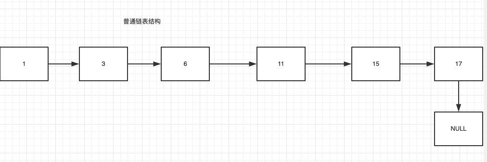
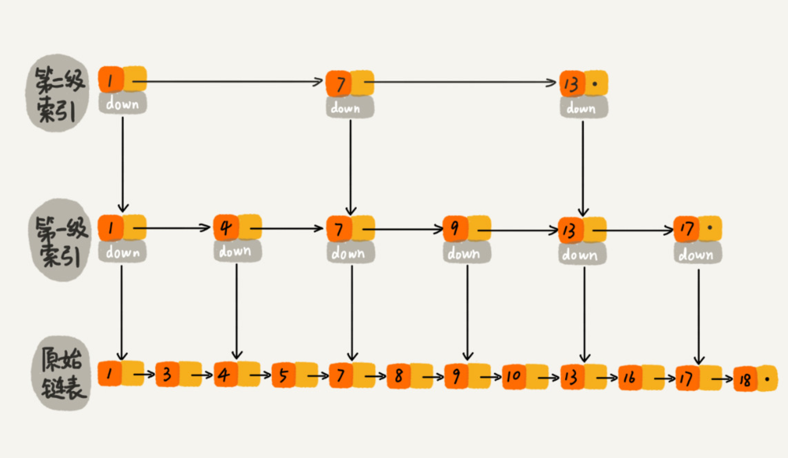

## ConcurrentSkipListMap

### 一、跳表讲解

1、为什么会出现跳表？

> 答案：跳表是对普通链表的查询节点优化而出现的。

2、先看一个普通链表结构



3、问题a：假如我要查询3这个节点，我只要往后一次就可以找到。

4、问题b：假如现在我要查询17这个节点，我要往后5次才可以找到。

> 总结：普通的链表查询时间复杂度是O(n)；但是插入时间复杂度是O(1)

5、引入跳表



> 1、查询得到改善，复杂度减到O(logn)。<br/>
> 2、插入的复杂度还是O(1)。<br/>
> 3、但是带来的就是节点增多，是一种空间换时间的做法。 

### 二、ConcurrentSkipListMap讲解

- 简介：跳表是一个随机化的数据结构，实质就是一种可以进行二分查找的有序链表。在原有的有序链表上面增加了多级索引，通过索引来实现快速查找。

- 存储结构


```markdown
// 数据节点，典型的单链表结构
static final class Node<K,V> {
    final K key;
    volatile Object value;
    volatile Node<K,V> next;
    
    Node(K key, Object value, Node<K,V> next) {
        this.key = key;
        this.value = value;
        this.next = next;
    }
    
    Node(Node<K,V> next) {
        this.key = null;
        this.value = this;
        this.next = next;
    }
}

// 索引节点，存储着对应的node值，及向下和向右的索引指针
static class Index<K,V> {
    final Node<K,V> node;
    final Index<K,V> down;
    volatile Index<K,V> right;
    
    Index(Node<K,V> node, Index<K,V> down, Index<K,V> right) {
        this.node = node;
        this.down = down;
        this.right = right;
    }
}

// 头索引节点，继承自Index，并扩展一个level字段，用于记录索引的层级
static final class HeadIndex<K,V> extends Index<K,V> {
    final int level;
    
    HeadIndex(Node<K,V> node, Index<K,V> down, Index<K,V> right, int level) {
        super(node, down, right);
        this.level = level;
    }
}
```
> Node，数据节点，存储数据的节点，典型的单链表结构；<br/>
> Index，索引节点，存储着对应的node值，及向下和向右的索引指针；<br/>
> HeadIndex，头索引节点，继承自Index，并扩展一个level字段，用于记录索引的层级；