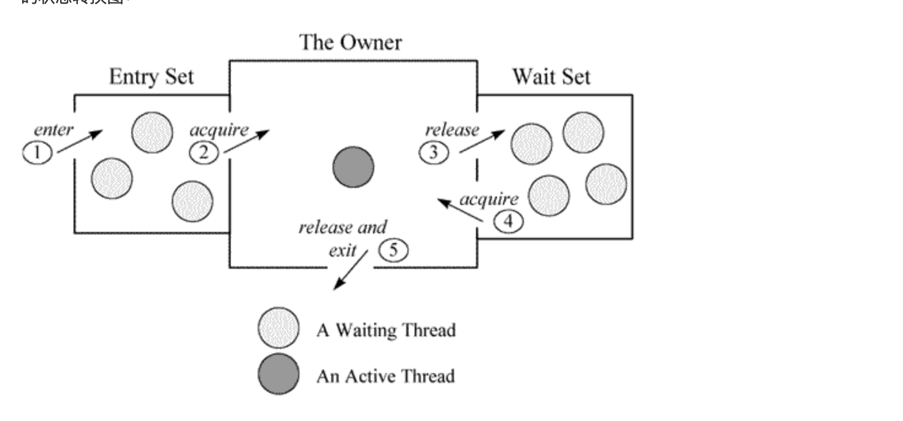

在JDK的bin目彔下,包含了java命令及其他实用工具。

jps:查看本机的Java中进程信息。

jstack:打印线程的栈信息,制作线程Dump。

jmap:打印内存映射,制作堆Dump。

jstat:性能监控工具。

jhat:内存分析工具。

jconsole:简易的可视化控制台。

jvisualvm:功能强大的控制台。

### JavaDump
Java虚拟机的运行时快照。将Java虚拟机运行时的状态和信息保存到文件。

线程Dump,包含所有线程的运行状态。纯文本格式。
### JavaDump的作用
补足传统Bug分析手段的不足: 可在任何Java环境使用;信息量充足。 针对非功能正确性的Bug,主要为:多线程幵发、内存泄漏。

### 1:jps
### 2:jstack
jstack用于生成java虚拟机当前时刻的线程快照。线程快照是当前java虚拟机内每一条线程正在执行的方法堆栈的集合，生成线程快照的主要目的是定位线程出现长时间停顿的原因，如线程间死锁、死循环、请求外部资源导致的长时间等待等。 线程出现停顿的时候通过jstack来查看各个线程的调用堆栈，就可以知道没有响应的线程到底在后台做什么事情，或者等待什么资源。 如果java程序崩溃生成core文件，jstack工具可以用来获得core文件的java stack和native stack的信息，从而可以轻松地知道java程序是如何崩溃和在程序何处发生问题。另外，jstack工具还可以附属到正在运行的java程序中，看到当时运行的java程序的java stack和native stack的信息, 如果现在运行的java程序呈现hung的状态，jstack是非常有用的。

总结来讲：jstack主要是来查看Java线程调用堆栈的，可以用来分析线程问题，如死锁。
线程状态：
NEW,未启动的。不会出现在Dump中。

RUNNABLE,在虚拟机内执行的。

BLOCKED,受阻塞并等待监视器锁。

WATING,无限期等待另一个线程执行特定操作。

TIMED_WATING,有时限的等待另一个线程的特定操作。

TERMINATED,已退出的。

#### Monitor

进入区(Entrt Set):表示线程通过synchronized要求获取对象的锁。如果对象未被锁住,则迚入拥有者;否则则在进入区等待。一旦对象锁被其他线程释放,立即参与竞争。

拥有者(The Owner):表示某一线程成功竞争到对象锁。

等待区(Wait Set):表示线程通过对象的wait方法,释放对象的锁,并在等待区等待被唤醒。

从图中可以看出，一个 Monitor在某个时刻，只能被一个线程拥有，该线程就是 “Active Thread”，而其它线程都是 “Waiting Thread”，分别在两个队列 “ Entry Set”和 “Wait Set”里面等候。在 “Entry Set”中等待的线程状态是 “Waiting for monitor entry”，而在“Wait Set”中等待的线程状态是 “in Object.wait()”。 先看 “Entry Set”里面的线程。我们称被 synchronized保护起来的代码段为临界区。当一个线程申请进入临界区时，它就进入了 “Entry Set”队列。对应的 code就像：

synchronized(obj) {
.........

}
调用修饰
表示线程在方法调用时,额外的重要的操作。线程Dump分析的重要信息。修饰上方的方法调用。

locked <地址> 目标：使用synchronized申请对象锁成功,监视器的拥有者。

waiting to lock <地址> 目标：使用synchronized申请对象锁未成功,在迚入区等待。

waiting on <地址> 目标：使用synchronized申请对象锁成功后,释放锁幵在等待区等待。

parking to wait for <地址> 目标

locked

at oracle.jdbc.driver.PhysicalConnection.prepareStatement
- locked <0x00002aab63bf7f58> (a oracle.jdbc.driver.T4CConnection)
at oracle.jdbc.driver.PhysicalConnection.prepareStatement
- locked <0x00002aab63bf7f58> (a oracle.jdbc.driver.T4CConnection)
at com.jiuqi.dna.core.internal.db.datasource.PooledConnection.prepareStatement
通过synchronized关键字,成功获取到了对象的锁,成为监视器的拥有者,在临界区内操作。对象锁是可以线程重入的。

waiting to lock

at com.jiuqi.dna.core.impl.CacheHolder.isVisibleIn(CacheHolder.java:165)
- waiting to lock <0x0000000097ba9aa8> (a CacheHolder)
at com.jiuqi.dna.core.impl.CacheGroup$Index.findHolder
at com.jiuqi.dna.core.impl.ContextImpl.find
at com.jiuqi.dna.bap.basedata.common.util.BaseDataCenter.findInfo
通过synchronized关键字,没有获取到了对象的锁,线程在监视器的进入区等待。在调用栈顶出现,线程状态为Blocked。

waiting on

at java.lang.Object.wait(Native Method)
- waiting on <0x00000000da2defb0> (a WorkingThread)
at com.jiuqi.dna.core.impl.WorkingManager.getWorkToDo
- locked <0x00000000da2defb0> (a WorkingThread)
at com.jiuqi.dna.core.impl.WorkingThread.run
通过synchronized关键字,成功获取到了对象的锁后,调用了wait方法,进入对象的等待区等待。在调用栈顶出现,线程状态为WAITING或TIMED_WATING。

parking to wait for

park是基本的线程阻塞原语,不通过监视器在对象上阻塞。随concurrent包会出现的新的机制,不synchronized体系不同。

线程动作
线程状态产生的原因

runnable:状态一般为RUNNABLE。

in Object.wait():等待区等待,状态为WAITING或TIMED_WAITING。

waiting for monitor entry:进入区等待,状态为BLOCKED。

waiting on condition:等待区等待、被park。

sleeping:休眠的线程,调用了Thread.sleep()。

Wait on condition 该状态出现在线程等待某个条件的发生。具体是什么原因，可以结合 stacktrace来分析。 最常见的情况就是线程处于sleep状态，等待被唤醒。 常见的情况还有等待网络IO：在java引入nio之前，对于每个网络连接，都有一个对应的线程来处理网络的读写操作，即使没有可读写的数据，线程仍然阻塞在读写操作上，这样有可能造成资源浪费，而且给操作系统的线程调度也带来压力。在 NewIO里采用了新的机制，编写的服务器程序的性能和可扩展性都得到提高。 正等待网络读写，这可能是一个网络瓶颈的征兆。因为网络阻塞导致线程无法执行。一种情况是网络非常忙，几 乎消耗了所有的带宽，仍然有大量数据等待网络读 写；另一种情况也可能是网络空闲，但由于路由等问题，导致包无法正常的到达。所以要结合系统的一些性能观察工具来综合分析，比如 netstat统计单位时间的发送包的数目，如果很明显超过了所在网络带宽的限制 ; 观察 cpu的利用率，如果系统态的 CPU时间，相对于用户态的 CPU时间比例较高；如果程序运行在 Solaris 10平台上，可以用 dtrace工具看系统调用的情况，如果观察到 read/write的系统调用的次数或者运行时间遥遥领先；这些都指向由于网络带宽所限导致的网络瓶颈。
