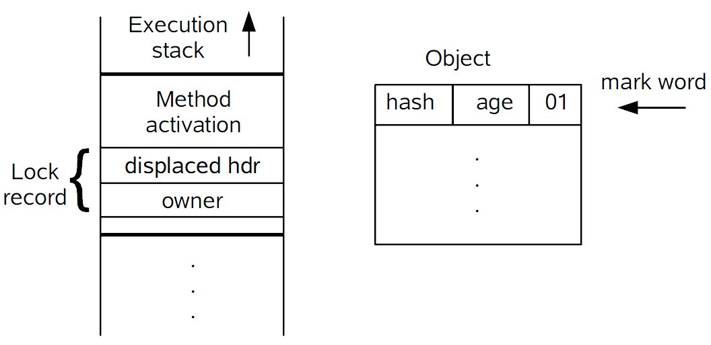
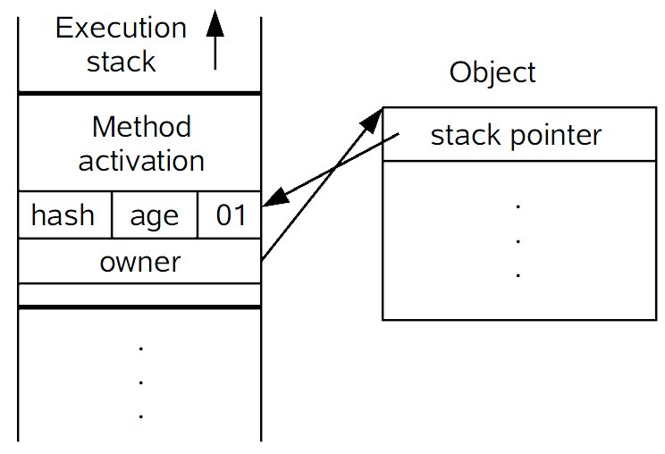

## Synchronized锁的演变

### 前言

提到锁就必须要说的线程安全问题，概念：“如果一个共享资源可以被多个线程同时使用，那它就是线程安全的”。简单地说，就是**多线程并发访问的环境下得到的结果和使用单线程操作的结果是一样的，那么就是线程安全的**。Java中用于解决线程安全的手段有很多，根据不同的场景常见的方式有：**不变量的使用（如：String），原子操作对象的使用（如：AtomicInteger）,volatile变量单个读写操作(i++这是复合变量的读写)，使用锁机制（synchronized，Lock，分布式锁）**等。

### java线程阻塞的代价

> java的线程是映射到操作系统原生线程之上的，如果要阻塞或唤醒一个线程就需要操作系统介入，需要在用户态与内核态之间切换，这种切换会消耗大量的系统资源，因为用户态与内核态都有各自专用的内存空间，专用的寄存器等，用户态切换至内核态需要传递给许多变量、参数给内核，内核也需要保护好用户态在切换时的一些寄存器值、变量等，以便内核态调用结束后切换回用户态继续工作。

**如下两个常见问题：**

* 如果线程状态切换是一个高频操作时，这将会消耗很多CPU资源
* 如果对于那些需要同步的简单的代码块，获取锁挂起操作消耗的时间比用户代码执行的时间还要长，这种同步策略性能就很低了

synchronized会导致争用不到锁的线程进入阻塞状态，所以说它是java语言中一个重量级的同步操纵，被称为重量级锁。在Java SE 1.6对它进行了各种优化，引入了轻量锁与偏向锁，默认启用了自旋锁。

> 自旋锁：为了让没有抢到锁的线程不立刻挂起，就让它自旋等待锁的释放，尽可能减少线程状态的切换

### synchronized实现同步的基础

1. Java中的每一个对象都可以作为锁 ，具体表现为以下3种方式

> * 对于普通同步方法，锁是当前实例对象（this）
> * 对于静态同步方法，锁是当前类的Class对象
> * 对于同步方法块，锁是synchronized括号里的对象

2. 当一个线程试图访问同步代码块或同步方法时，首先必须得到锁，退出或抛出异常时必须释放锁

3. synchonized在JVM里的实现原理是JVM基于进入和退出**Monitor对象**来实现方法同步和代码块同步，只不过它们的实现细节不一样。代码块同步是使用**monitorenter**和**monitorexit**指令实现的，而方法的同步使用另外一种方式实现的，JVM规范中没有详细说明，不过方法的同步同样可以使用这个两个指令来实现。

4. **monitorenter**指令是在编译后插入到同步代码块的开始位置，**monitorexit**指令是插入到代码块结束处和异常处，这两个指令必须是配对的。任何对象都有一个monitor和它关联，在线程进入时通过`monitorenter`尝试取得对象`monitor`所有权（获取对象的锁），退出时通过`monitorexit`释放对象`monitor`所有权（释放对象的锁）

   ```Java
   public class Synchronized {
       public static void main(String[] args) {
           /** 同步代码块*/
           synchronized (Synchronized.class) {
               System.out.println("hello shunhua");
           }
           sayHello();
       }
       /** 同步方法*/
       public static synchronized void sayHello() {
       }
   }
   ```

   ```Java
   F:\code\resourcecode\out\production\resourcecode>javap -v Synchronized.class
   Classfile /F:/code/resourcecode/out/production/resourcecode/Synchronized.class
     Last modified 2018-12-20; size 721 bytes
     MD5 checksum 0744df0cf0c65e82f07e38821f45815d
     Compiled from "Synchronized.java"
   public class Synchronized
     minor version: 0
     major version: 52
     flags: ACC_PUBLIC, ACC_SUPER
   Constant pool:
      #1 = Methodref          #7.#26         // java/lang/Object."<init>":()V
      #2 = Class              #27            // Synchronized
      #3 = Fieldref           #28.#29        // java/lang/System.out:Ljava/io/PrintStream;
      #4 = String             #30            // hello shunhua
      #5 = Methodref          #31.#32        // java/io/PrintStream.println:(Ljava/lang/String;)V
      #6 = Methodref          #2.#33         // Synchronized.sayHello:()V
      #7 = Class              #34            // java/lang/Object
      #8 = Utf8               <init>
      #9 = Utf8               ()V
     #10 = Utf8               Code
     #11 = Utf8               LineNumberTable
     #12 = Utf8               LocalVariableTable
     #13 = Utf8               this
     #14 = Utf8               LSynchronized;
     #15 = Utf8               main
     #16 = Utf8               ([Ljava/lang/String;)V
     #17 = Utf8               args
     #18 = Utf8               [Ljava/lang/String;
     #19 = Utf8               StackMapTable
     #20 = Class              #18            // "[Ljava/lang/String;"
     #21 = Class              #34            // java/lang/Object
     #22 = Class              #35            // java/lang/Throwable
     #23 = Utf8               sayHello
     #24 = Utf8               SourceFile
     #25 = Utf8               Synchronized.java
     #26 = NameAndType        #8:#9          // "<init>":()V
     #27 = Utf8               Synchronized
     #28 = Class              #36            // java/lang/System
     #29 = NameAndType        #37:#38        // out:Ljava/io/PrintStream;
     #30 = Utf8               hello shunhua
     #31 = Class              #39            // java/io/PrintStream
     #32 = NameAndType        #40:#41        // println:(Ljava/lang/String;)V
     #33 = NameAndType        #23:#9         // sayHello:()V
     #34 = Utf8               java/lang/Object
     #35 = Utf8               java/lang/Throwable
     #36 = Utf8               java/lang/System
     #37 = Utf8               out
     #38 = Utf8               Ljava/io/PrintStream;
     #39 = Utf8               java/io/PrintStream
     #40 = Utf8               println
     #41 = Utf8               (Ljava/lang/String;)V
   {
     public Synchronized();
       descriptor: ()V
       flags: ACC_PUBLIC
       Code:
         stack=1, locals=1, args_size=1
            0: aload_0
            1: invokespecial #1                  // Method java/lang/Object."<init>":()V
            4: return
         LineNumberTable:
           line 1: 0
         LocalVariableTable:
           Start  Length  Slot  Name   Signature
               0       5     0  this   LSynchronized;

     public static void main(java.lang.String[]);
       descriptor: ([Ljava/lang/String;)V
       flags: ACC_PUBLIC, ACC_STATIC
       Code:
         stack=2, locals=3, args_size=1
            0: ldc           #2                  // class Synchronized
            2: dup
            3: astore_1
            /** monitorenter出现 */
            4: monitorenter
            5: getstatic     #3                  // Field java/lang/System.out:Ljava/io/PrintStream;
            8: ldc           #4                  // String hello shunhua
           10: invokevirtual #5                  // Method java/io/PrintStream.println:(Ljava/lang/String;)V
           13: aload_1
           /** 代码块monitorexit出现 */
           14: monitorexit
           15: goto          23
           18: astore_2
           19: aload_1
           /** 异常处monitorexit出现 */
           20: monitorexit
           21: aload_2
           22: athrow
           23: invokestatic  #6                  // Method sayHello:()V
           26: return
         Exception table:
            from    to  target type
                5    15    18   any
               18    21    18   any
         LineNumberTable:
           line 4: 0
           line 5: 5
           line 6: 13
           line 7: 23
           line 8: 26
         LocalVariableTable:
           Start  Length  Slot  Name   Signature
               0      27     0  args   [Ljava/lang/String;
         StackMapTable: number_of_entries = 2
           frame_type = 255 /* full_frame */
             offset_delta = 18
             locals = [ class "[Ljava/lang/String;", class java/lang/Object ]
             stack = [ class java/lang/Throwable ]
           frame_type = 250 /* chop */
             offset_delta = 4

     public static synchronized void sayHello();
       descriptor: ()V
       /**  同步方法这里依靠方法修饰符上的 ACC_SYNCHRONIZED来完成的 */
       flags: ACC_PUBLIC, ACC_STATIC, ACC_SYNCHRONIZED
       Code:
         stack=0, locals=0, args_size=0
            0: return
         LineNumberTable:
           line 11: 0
   }
   SourceFile: "Synchronized.java"
   ```

   > 小结：无论采用哪种方式，其本质是对一个对象的监视器（Monitor）进行获取，而这个获取过程是排他的，也就是同一时刻只能一个线程获取到由synchronized所保护对象的监视器。

   ​

### Java对象头

1. 在HotSpot虚拟机中，对象在内存中存储的布局可以分为3块区域：对象头（Header）、实例数据（Instance Data）和对齐填充，而synchronized用的锁是存在Java对象头里的。其中，markword是对象头很重要的一部分，它是实现轻量级锁和偏向锁的关键。

2. markword数据的长度在32位和64位的虚拟机中分别为32bit和64bit，它的最后2bit是锁状态标志位，用来标记当前对象的状态，对象的所处的状态，决定了markword存储的内容，如下表所示:


### 锁的升级与对比

Java SE 1.6 为了减少获得锁和释放锁带来的性能消耗，引入了偏向锁和轻量级锁，在Java SE 1.6中，锁一共有4种状态，级别从低到高依次是：无锁状态、偏向锁状态、轻量级状态和重量级锁状态，这几个状态会随着竞争情况逐渐升级。锁可以升级但不能降级，目的是为了提高获得锁和释放锁的效率。需要注意的是这里的锁降级指的是synchronized实现的锁，对于读写锁ReentrantReadWriteLock是可以进行降级的，由写锁降级为读锁（遵循获取写锁，获取读锁再释放写锁的顺序）。

### 偏向锁

Java偏向锁是Java6引入的一项多线程优化。 偏向锁，顾名思义，它会偏向于第一个访问锁的线程，如果在运行过程中，同步锁只有一个线程访问，不存在多线程争用的情况，则线程是不需要触发同步的，这种情况下，就会给线程加一个偏向锁。 如果在运行过程中，遇到了其他线程抢占锁，则持有偏向锁的线程会被挂起，JVM会消除它身上的偏向锁，将锁恢复到标准的轻量级锁。

#### 偏向锁的实现


**获取过程 **

当一个线程获取锁时，会使用CAS在对象头的Mark Word中存储锁偏向的线程ID，以后该线程在进入和退出同步块时不需要进行CAS操作来加锁和解锁，
只需要测试下对象头的Mark Word里是否存储指向当前线程的偏向锁（当前线程ID），测试成功表示线程已经获得了锁。测试失败，需要检查Mark Word
中偏向锁的标识是否设置成了01即确认为可偏向状态，如果设置了，就通过CAS操作竞争锁，如果竞争成功，则将Mark Word中线程ID设置为当前线程ID，
如果竞争失败，表示有竞争，就会执行偏向锁的撤销。

>注意：第四步中到达安全点safepoint会导致stop the word，时间很短。

#### 偏向锁的释放

偏向锁只有遇到其他线程尝试竞争偏向锁时，持有偏向锁的线程才会释放锁，线程不会主动去释放偏向锁。偏向锁的撤销，需要等待全局安全点（在这个时间点上没有字节码正在执行），
它会首先暂停拥有偏向锁的线程，根据锁对象是否处于被锁定状态，撤销偏向锁后恢复到未锁定（标志位为01）或轻量级锁（标志位为00）的状态。

#### 偏向锁的适用场景

始终只有一个线程在执行同步块，在它没有执行完释放锁之前，没有其它线程去执行同步块，在锁无竞争的情况下使用。如果应用程序里锁通常都处于竞争状态，最好关闭偏向锁，因为撤销偏向锁会造成更大的资源消耗。

#### jvm开启/关闭偏向锁
> 偏向锁在 Java 6和Java 7中是默认启用的

开启偏向锁：-XX:+UseBiasedLocking -XX:BiasedLockingStartupDelay=0

关闭偏向锁：-XX:-UseBiasedLocking

### 轻量级锁

Java轻量级锁也是Java6引入的一项多线程优化，轻量级锁是由偏向锁升级来的。 

#### 轻量级锁的加锁过程：

1. 在代码进入同步块的时候，如果同步对象锁状态为无锁状态（锁标志位为01），虚拟机首先将在当前线程的栈帧中建立一个名为锁记录（Lock Record）的空间，用于存储锁对象目前的Mark Word的拷贝，官方称之为 Displaced Mark Word。这时线程堆栈与对象头的状态如图： 


2. 拷贝对象头中的Mark Word复制到锁记录中；

3. 拷贝成功后，虚拟机将使用CAS操作尝试将对象的Mark Word更新为指向Lock Record的指针，并将Lock record里的owner指针指向object mark word。如果更新成功，则执行步骤4，否则执行步骤5。

4. 如果这个更新动作成功了，那么这个线程就拥有了该对象的锁，并且对象Mark Word的锁标志位设置为00，即表示此对象处于轻量级锁定状态，这时候线程堆栈与对象头的状态如图所示。 

　　

5. 如果这个更新操作失败了，虚拟机首先会检查对象的Mark Word是否指向当前线程的栈帧，如果是就说明当前线程已经拥有了这个对象的锁，那就可以直接进入同步块继续执行。否则说明多个线程竞争锁，这个锁对象已经被其他线程抢占了。轻量级锁就要膨胀为重量级锁，锁标志的状态值变为10，Mark Word中存储的就是指向重量级锁的指针，后面等待锁的线程也要进入阻塞状态。
 而当前线程便尝试使用自旋来获取锁，自旋就是为了不让线程阻塞，如果自旋成功则依然处于轻量级状态，自旋失败也会被挂起。

#### 轻量级锁的释放
它的解锁过程也是通过CAS操作来进行的，如果对象的Mark Word仍然指向着线程的锁记录，那就用CAS操作把对象当前的Mark Word和线程中复制的Displaced Mark Word替换回来，如果替换成功，整个同步过程就完成了。如果失败，说明有其他线程
尝试过获取该锁，锁就会膨胀为重量级锁，在释放锁的同时，唤醒被挂起的线程。

### 小结

上面几种锁都是JVM自己内部实现，当我们执行synchronized同步块的时候jvm会根据启用的锁和当前线程的争用情况，决定如何执行同步操作。在所有的锁都启用的情况下线程进入临界区时会先去获取偏向锁，如果已经存在偏向锁了就会进行锁的升级，尝试获取轻量级锁，则使用重量级锁，
没有获取到锁的线程阻塞挂起，直到持有锁的线程执行完同步块唤醒他们。


### 锁相关拓展

减少锁的时间、减少锁的粒度、锁粗化、使用读写锁、读写分离（CopyOnWriteArrayList、CopyOnWriteArraySet）、使用CAS（通常在线程竞争不激烈情况下结合volatile使用）、自旋锁与自适应自旋、锁消除等。