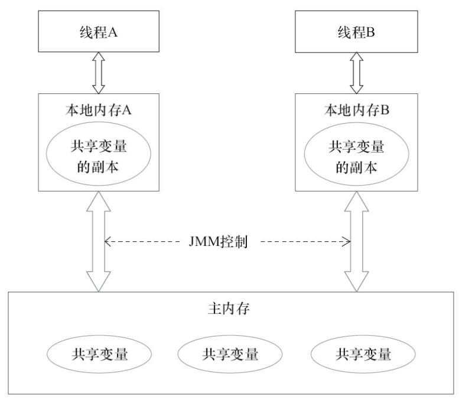
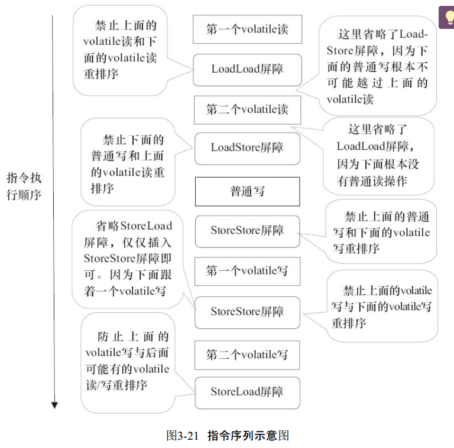

## Volatile关键词

### Java内存模型
在了解这个关键词之前，我们先了解一下JMM，Java内存模型。

Java线程之间的通信由Java内存模型控制，JMM决定一个线程对共享变量的写入何时对另一个线程可见。从抽象的角度来看，JMM定义了线程和主内存之间的抽象关系：线程之间的共享变量存储在主内存（Main Memory）中，每个线程都有一个私有的本地内存（Local Memory），本地内存中存储了该线程以读/写共享变量的副本。本地内存是JMM的一个抽象概念，并不真实存在。它涵盖了缓存、写缓冲区、寄存器以及其他的硬件和编译器优化。Java内存模型的抽象示意如下图所示。



java内存模型规定了所有的变量都存储在住内存。每条线程还有自己的工作内存，线程的工作内存中保存了被改线程使用到的变量的主内存副本拷贝。线程对变量的所有操作都必须在工作内存中进行，而不能直接读写主内存中的变量。不同线程之间也无法直接访问对方工作内存中的变量，线程间变量传递均需要通过主内存来完成。当多个线程操作的变量涉及到同一个主内存区域，将可能导致各自的工作线程数据不一致，这样就导致变量同步回主内存的时候可能冲突导致数据丢失。

说完了，我们先来看一个小例子。
```java
public class Test4 {
    public static int num = 0;
    //使用CountDownLatch来等待计算线程执行完
    static CountDownLatch countDownLatch = new CountDownLatch(30);
    public static void main(String []args) {
        //开启30个线程进行累加操作
        for(int i=0;i<30;i++){
            new Thread(){
                @Override
                public void run(){
                    for(int j=0;j<10000;j++){
                        //自加操作
                        num++;
                    }
                    countDownLatch.countDown();
                }
            }.start();
        }
        //等待计算线程执行完
        countDownLatch.await();
        System.out.println(num);
    }
}

//得出的结果是：161976
//期望得到的结果是：300000
```
简单介绍一下`CountDownLatch`：
`CountDownLatch`是通过`共享锁`实现的。在创建`CountDownLatch`中时，会传递一个int类型参数count，该参数是`锁计数器`的初始状态，表示该`共享锁`最多能被count线程同时获取。当某线程调用该`CountDownLatch`对象的await()方法时，该线程会等待`共享锁`可用时，才能获取`共享锁`进而继续运行。而`共享锁`可用的条件，就是`锁计数器`的值为0！而`锁计数器`的初始值为count，每当一个线程调用该`CountDownLatch`对象的countDown()方法时，才将`锁计数器`-1。


分析可知：
假设此时有两个线程，线程1修改了num值，但是并没有来的及将本地缓存的值更新到共享缓存中，这是线程2读取了num值并做修改更新了共享缓存，造成了数据不一致没有达到期望值。这时候要引进一下`volatile`关键词了。


### volatile的作用：

- 修饰某个变量，保证变量对所有的线程可见
- 禁止指令重排序优化

#### 怎么保证可见性：

底层的实现了解一波：

参考：https://blog.csdn.net/y124675160/article/details/78310121

了解一下主内存和工作线程的交互的操作有这么几种：

- lock（锁定）：作用于主内存的变量，它把一个变量标识为一条线程独占的状态
- unlock（解锁）：作用于主内存的变量，释放锁定状态的变量
- use（使用）：作用于工作内存的变量，把工作内存中一个变量的值传递给执行引擎，每当虚拟机遇到一个需要使用到变量的值的字节码指令时将会执行这个操作
- assign（赋值）：作用于工作内存的变量，把一个从执行引擎收到的值赋给工作内存的变量，每当虚拟机遇到一个给变量赋值的字节码指令时将会执行这个操作
- read（读取）：作用于主内存的变量，把一个变量从主内存传输到线程的工作内存中，以便随后的load动作使用
- load（载入）：作用于工作内存的变量，把read操作从主内存中得到的变量值放入工作内存的变量副本中。
- store（存储）：作用于工作内存的变量，把工作内存的一个变量值传送到主内存，以便随后的write操作使用
- write（写入）：作用于主内存的变量，把store操作从工作内存得到的变量的值放入主内存变量中。

**虚拟机实现必须保证上面的每一种操作都是原子的。**

JMM通过控制主内存与每个线程的本地内存之间的交互，控制内存可见性。通俗说，多线程访问下，volatile写操作的同时将本地内存的值更新到主内存，volatile读操作，也是从主内存读取数据。以上面的操作来说，如果要把一个变量从主内存复制到工作内存，需要顺序执行read和load操作，如果要把变量从工作内存同步回住内存，就要顺序地执行store和write操作，故read和load、store和write必须成对出现。保证了工作内存和主内存中

对上面的代码修改一波，使用`volatile`，保证num对所有线程可见。

``` 
//使用volatile关键字
 public static int num = 0;

 public static volatile int num = 0;
 
 此时得到的结果：167665

```
为什么保证了num值对线程可见还是不能得到期望值？

并发编程中有三个性质：
- 原子性
- 可见性
- 顺序性

我们通过`volatile`保证了`可见性`，但是在上述代码中`volatile`并不能保证它的`原子性`。

看下`原子性`：对于原子就是不可再分割的粒子，对于原子操作就是不可中断的一个或一系列操作。

对于num++来说，是三个步骤：先读取num值，再执行++操作，最后在存储最终结果，不是原子操作。

最后使用原子操作类保证`原子性`的：
```java
public class Test4 {
   
    //使用原子操作类
    public static AtomicInteger num = new AtomicInteger(0);
    //使用CountDownLatch来等待计算线程执行完
    static CountDownLatch countDownLatch = new CountDownLatch(30);
    public static void main(String []args) throws InterruptedException {
        //开启30个线程进行累加操作
        for(int i=0;i<30;i++){
            new Thread(){
                @Override
                public void run(){
                    for(int j=0;j<10000;j++){
                        //原子性的num++,通过循环CAS方式
                        num.incrementAndGet();
                    }
                    countDownLatch.countDown();
                }
            }.start();
        }
        //等待计算线程执行完
        countDownLatch.await();
        System.out.println(num);
    }
}
//结果：300000
```
#### 为什么AtomicInteger可以保证原子性？看源码么

简单看下
```
public final int incrementAndGet() {
        return unsafe.getAndAddInt(this, valueOffset, 1) + 1;
    }

 public final int getAndAddInt(Object var1, long var2, int var4) {
        int var5;
        do {
            var5 = this.getIntVolatile(var1, var2);
        } while(!this.compareAndSwapInt(var1, var2, var5, var5 + var4));

        return var5;
    }

```
可以看到，实现了一个CAS来实现原子操作

#### 再来看看，重排序优化的问题。

有个很经典的例子，就是单例模式中有个双重判断。

```java
class Singleton{
    private static Singleton instance = null;
    
    private Singleton() {
         
    }
    public static Singleton getInstance() {
        if(instance==null) {
            synchronized (Singleton.class) {
                if(instance==null)
                    instance = new Singleton();
            }
        }
        return instance;
    }
}
```
对于一个new来说

①分配对象的内存空间-->②初始化对象 --> ③将instance指向刚分配好的内存地址

上面的语句中，②是依赖于①的，所以②在①之后执行，但是③和②不存在依赖性，也就是执行顺序可能是：①->③->②。
如果是单线程的程序（真的只有一个线程可以访问到它们），那么如果后续程序使用到了instance，JVM会保证你使用instance的时候是初始化完成的，
但是现在在synchronized块之外有其它线，获取到锁的线程如果按照①->③->②的顺序执行，那在执行③的时候会store-write，即将值写回主内存，则其它线程会读到最新的instance值，而现在这个instance指向的是一个不完全的对象，即不安全对象，也不可用，使用这个对象是有危险的，此时构造对象的线程还没有释放锁，其它线程进行第一次检查的时候，null == instance的结果是false，会返回这个对象，造成程序的异常。

| 线程A      |	线程B  |
|-----------|---------|
|1.分配对象的内存空间 | |	
|3.将instance指向分配好的内存地址||	
||instance是否为null|
||不是null，但是未初始化，有空指针异常|
|2.初始化对象	||

####列出几种解决办法：

1.变量使用volatile关键词修饰，volatile的一个特性重排序优化
``` java
  private static volatile Singleton instance = null;

```

##### volatile如何实现重排序优化：

volatile关键字的一个作用是禁止指令重排，把instance声明为volatile之后，对它的写操作就会有一个内存屏障，这样，在它的赋值完成之前，就不用会调用读操作。

注意：volatile阻止的不是singleton = new Singleton()这句话内部①,②,③的指令重排，而是保证了在一个写操作（①,②,③）完成之前，不会调用读操作（if (instance == null)）。

说下内存屏障的问题：
volatile实现了：
- 在每个volatile写之前，插入storestore屏障
- 在每个volatile写之后，插入storeload屏障
- 在每个volatile读之后，插入loadload屏障
- 在每个volatile读之后，插入loadstore屏障

指令顺序示意图：


具体请参考《java并发编程艺术》

2.内部类延迟加载
```java
public class InstanceFactory{
    private static class InstanceHolder{
        public static Instance instance = new Instance();
    }
    public static Instance getInstance(){
        return InstanceHolder.instance;         //这里将导致InstanceHolder类被初始化
    }
}
//内部类的初始化是延迟的，外部类初始化时不会初始化内部类，只有在使用的时候才会初始化内部类。
```


