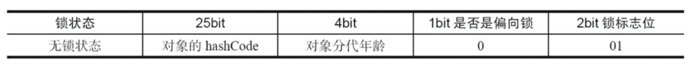
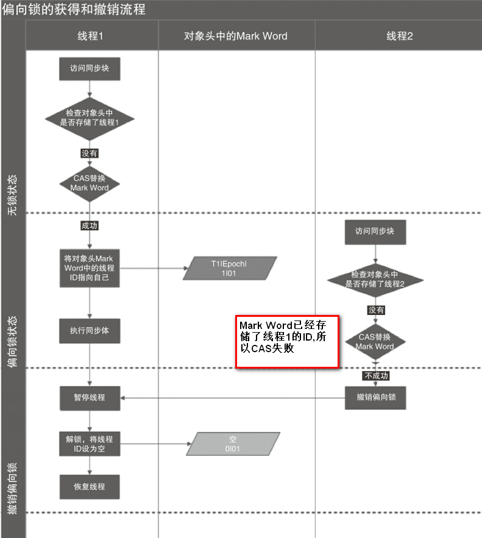

### synchronized关键字

#### 1、为什么使用synchronized???

- 优势一：简单实现同步，解决线程安全问题
- 优势二：jdk1.5之后，synchronized关键字做了一次优化
- 优势三：...待补充

#### 2、synchronized-使用方式

- 方式一：修饰静态方法
```markdown
public static void synchronized method(){
    doSomething();
}
```

- 方式二：修饰实例方法
```markdown
public void synchronized method(){
    doSomething();
}
```

- 方式三：修饰实例
```markdown
public void method(){
    synchronized(this){
        doSomething();
    }
}
```

- 方式四：修饰类类型
```markdown
public void method(){
    synchronized(Example.class){
        doSomething();
    }
}
```
- 方式五：修饰任意对象实例
```markdown
public void method(){
    String lock = "";
    synchronized(lock){
        doSomething();
    }
}
```

##### 2.1 对象锁、类锁的概念
对于以上使用方法中：
>对象锁：synchronized修饰方法或代码块,锁的是对象的实例
>类锁：synchronized修饰静态方法或静态代码块(实际不存在，用于区分非静态),一个class其中的静态方法和静态变量在内存中只会加载和初始化一份，所以，一旦一个静态的方法被申明为synchronized，此类的所有的实例化对象在调用该方法时，共用同一把锁

代码链接：
https://github.com/fanhaoyuegroup/interest-group/tree/master/multi-thread/src/main/java/com/fan/thread/thread_basic_02

通过实例（不考虑嵌套的情况下）：

- 不同实例之间的对象锁互不影响
- 对象锁和类锁之间互不影响
- 对同一实例或不同实例对象的类锁

##### 2.2 Synchronized避免使用String字符串作为锁对象

常量池特性

- 总结：
    - 1、synchronized实现线程安全一定要关联一个对象（可以是实例、类类型）
    - 2、与ReentrantLock对比缺乏灵活性。

#### 3、synchronized-特点

- 1、利用每个对象关联的监视器Monitor实现互斥
- 2、可重入性
- 3、锁膨胀
- 4、解决重排序问题
- 5、...待补充

#### 4、synchronized-Mark Word结构



Java里面的对象分三块（对象头、实例数据、对齐填充），对象头分两部分信息

- 1、存储对象自身运行时的数据（Mark Word）
    - HashCode码（哈希code）
    - GC分代年龄(随着使用时间和数据大小生成的)
    - 锁标志位(标志为哪种锁：01 无锁 00轻量级锁 10重量级锁 11GC 01偏向锁)
    - 线程持有的锁id
    - 偏向锁线程id
    - 是否为偏向锁（0不是 1是）
- 2、类型指针：虚拟机需要根据这个指针来确认该对象是那个类的实例

#### 5、synchronized-对象锁状态流转

首先澄清一个点，锁膨胀不可降级，是指无锁或者偏向锁->轻量级锁->重量级锁。无锁和偏向锁两种初始化状态的锁是可以置换的

- 无锁：就是无人去竞争锁
- 偏向锁：synchronized设计者在一次试验发现，如果每次竞争都是由同一个线程获取，那就不需要这次竞争，所以引入偏向锁概念
    - 偏向锁获取：当一个线程获取，发现无锁状态，会在对象头里和栈帧里存储偏向线程id，那么下次来的时候，只需要简单判断对象头里的偏向所id是否一致。
    - 偏向锁撤销：
        - 触发点：有线程来竞争才撤销
        - 过程1：等到全局安全点(???)
        - 过程2：暂停拥有偏向锁的线程
        - 过程3：判断线程是否存活,false将对象头设置为无锁状态，否则将对象头里的偏向id设置为其他线程、或者恢复到无锁、或者锁升级
        - 过程4：恢复暂停的线程
        - 
        - **安全点**指的就是，当线程运行到这类位置时，堆对象状态是确定一致的，JVM可以安全地进行操作。
- 轻量级锁：不会阻塞
    - 加锁：
        - 1、先在当前线程的栈帧中存储锁记录的空间，并将对象头的Mark Word赋值到锁记录中。
        - 2、然后CAS将对象头的Mark Word 替换为指向锁记录的指针。
        - 3、如果CAS成功，获取锁，反之，自旋来获取锁。
    - 解锁：
        - 1、解锁过程可能会导致锁膨胀，细节待补充...
        - 
- 重量级锁：阻塞
    - 细节待补充...

