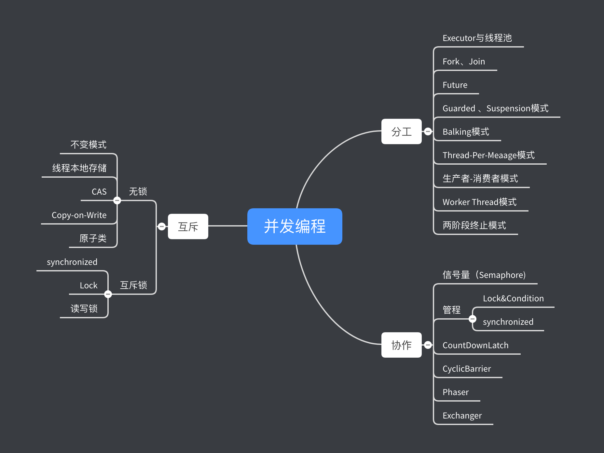

## 分工
Executor、Fork\Join、Future本质上都是一种分工办法。除此之外，并发编程领域还总接了一些设计模式，比如生产者-消费者、Thread-Per—Message、Work Thread等模式都是来指导如何分工的。
## 同步
主要是线程间的协作。一个线程执行完了任务，如何通知后续任务的线程开工。Executor、Fork\Join、Future本质上都是分工方法，但同时也能够解决线程协作问题。

在Java并发领域，解决协作问题的核心技术就是管程，上面提到的所有线程协作技术底层都是使用管程解决的。管程是解决并发问题的通用模型，出了能解决线程协作问题，还能解决互斥问题。
管程可以说是解决并发问题的万金油。

## 互斥