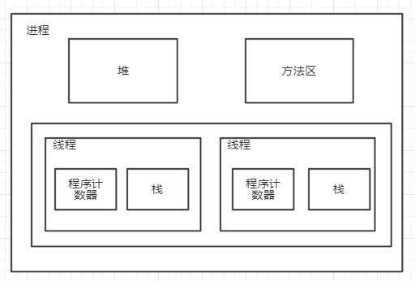
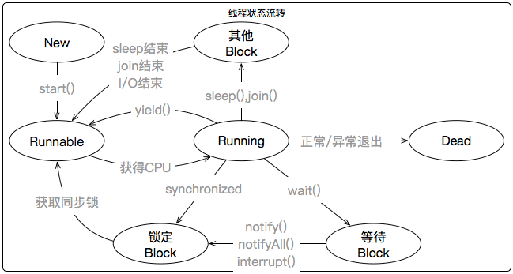
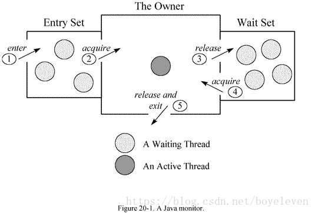

### 一、线程状态

线程进程的理解：

进程：是系统进行资源分配和调度的基本单位

线程：进程的一个执行路径，是CPU分配的基本单位

线程和进程的关系：




状态图示



#### 状态说明
- 新建状态（new），即线程对象被创建后就进入了新建状态。例如Thread t = new Thread()。
- 就绪状态（Runnable），也可以理解为待执行状态。线程对象被创建后，被其他线程调用了该线程对象的start方法启动线程。例如在main方法里调用t.start()方法。注意：刚刚提到的启动线程只是将新建状态转为就绪状态，并没有真正执行run方法。
- 运行状态（Running），线程获取到CPU权限进行执行run方法里面代码。注意：运行状态只能是Runnable流转成Running状态。
- 阻塞状态（Blocked），这个状态是线程由于某种原因放弃CPU使用权，暂时停止运行。直到线程进入就绪状态（也就是我们常说的锁没有拿到，一直在等待拿锁，拿到锁即流转成就绪状态），然后才有机会获取CPU使用权。阻塞的情况分三种：
>1、等待阻塞（对应上图等待Block）：调用线程的wait方法，让线程等待某工作的完成。
>
>2、同步阻塞（对应上图锁定Block）：线程在获取synchronized同步锁失败（被其他线程占用），会进入同步阻塞。
>
>3、其他堵塞（对应上图其他Block）：调用线程的sleep()或join()方法或者发出了I/O请求，线程会进入阻塞状态。当sleep()状态超时、join()等待线程终止或者超时、或者I/O处理完毕时，线程重新转入就绪状态。
- 死亡状态（Dead），线程正常执行完毕或者因异常退出了run方法，线程即结束。

### 二、Java实现多线程方式
1、常用方式（以下的方式不带返回值）

继承Thread类，重写run方法

```java
public class MyThread extends Thread {
    private Integer count = 5;
    @Override
    public void run() {
        synchronized (this) {
        while (count > 0) {
                count--;
                System.out.println(Thread.currentThread().getName() + ":" + count);
            }
        }
    }
    public static void main(String[] args) {
        MyThread myThread = new MyThread();
        Thread t2 = new Thread(myThread, "b");
        t2.start();
    }
}
```
实现Runnable接口，重写run方法

```java
public class MyRunnableTest implements Runnable {
    private int count = 5;
    @Override
    public void run() {
        while (count>0){
            count--;
            System.out.println("count:"+count);
        }
    }
    public static void main(String[] args) {
        Runnable runnable = new MyRunnableTest();
        Thread thread = new Thread(runnable);
      //  runnable.run();
        thread.start();
    }
}
```
> 有个问题？run()方法和start()方法的区别：
``` 
通常调用start()方法启动线程；
如果直接调用run()方法，该方法也会执行，但会被当做一个普通的方法，在当前线程中顺序执行；
而如果使用start()方法，则会创建一个新的线程执行run()方法。

```

2、非常用方式（以下方式可以带返回值）

实现Callable接口，重写call方法，创建线程的时候需要使用FutureTask类包一次
Callable提供了一个方法call()：可以有返回值、可以声明抛出异常

```java
class CallableTest implements Callable<Integer>{
    @Override
    public Integer call() throws Exception {
        System.err.println("计算处理中...");
        Thread.sleep(3000);
        return 1;
    }
    public static void main(String[] args) {
        //构建任务
        CallableTest t2 = new CallableTest();
        FutureTask<Integer> task = new FutureTask<Integer>(t2);
        //启动线程
        new Thread(task).start();
        //获取结果
        try {
            Integer integer = task.get(5000, TimeUnit.MILLISECONDS);
            System.out.println("线程执行结果："+integer);
        } catch (Exception e) {
            e.printStackTrace();
        }
    }
}
```
线程池创建线程


### 三、线程有关的方法
#### 1、Object类
wait系列方法：让当前线程进入等待状态，注意：wait()方法会让当前线程释放锁。
notify()：唤醒在此对象监视器上等待的单个线程,具体唤醒哪个由JVM决定
notifyAll()：唤醒在此对象监视器上等待的所有线程，唤醒线程的顺序由JVM决定
```java
public class MyRunnable {
    static private Object lock = new Object();
    static private Runnable runnable = new Runnable() {
        @Override
        public void run() {
            try {
                synchronized (lock){
                    System.out.println("线程"+Thread.currentThread().getName()+" wait begin time="+System.currentTimeMillis());
                    lock.wait(5000);
                    System.out.println("线程"+Thread.currentThread().getName()+" wait end time="+System.currentTimeMillis());
                }
            } catch (InterruptedException e) {
                e.printStackTrace();
            }
        }
    };

    static private Runnable runnable2 = new Runnable() {
        @Override
        public void run() {
            synchronized (lock){
                System.out.println("线程"+Thread.currentThread().getName()+" notify begin time = "+System.currentTimeMillis());
                lock.notify();
                System.out.println("线程"+Thread.currentThread().getName()+" notify end time = "+System.currentTimeMillis());
            }
        }
    };

    public static void main(String[] args) throws InterruptedException {
        Thread t= new Thread(runnable,"A");
        t.start();
        Thread.sleep(3000);
        Thread t2= new Thread(runnable2,"B");
        t2.start();
    }
}

//执行结果：
//线程A wait begin time=1561452476622
//线程B notify begin time = 1561452479622
//线程B notify end time = 1561452479622
//线程A wait end time=1561452479622
```

思考：
```java
static private Runnable runnable2 = new Runnable() {
        @Override
        public void run() {
            synchronized (lock){
                System.out.println("线程"+Thread.currentThread().getName()+" notify begin time = "+System.currentTimeMillis());
                lock.notify();
                //如果在此地休眠5s会释放去执行runnable吗？runnable2会释放锁码
                Thread.sleep(5000);
                System.out.println("线程"+Thread.currentThread().getName()+" notify end time = "+System.currentTimeMillis());
            }
        }
    };
```

#### 总结一下
    wait与notify方法一定要借助第三者达到监视器的作用（即必须在同步代码(Synchronized)中调用）
    对象监听器（moniter）
    操作系统知识引入：
    操作系统有个概念叫"信号量"，互斥(mutex)是一个二进制的信号量，互斥即排他，信号量只允许一个线程通过
    临界区：通过信号量执行的代码块
    Java实现的监视器
    每个类和对象在逻辑上都和一个对象监视器关联Moniter
    其次Java已经在synchronized关键字包裹的代码块在编译之后的class代码里会自动加上互斥条件

moniter机制：


Monitor可以类比为一个特殊的房间，这个房间中有一些被保护的数据，Monitor保证每次只能有一个线程能进入这个房间进行访问被保护的数据，进入房间即为持有Monitor，退出房间即为释放Monitor。

当一个线程需要访问受保护的数据（即需要获取对象的Monitor）时，它会首先在entry-set入口队列中排队（这里并不是真正的按照排队顺序），如果没有其他线程正在持有对象的Monitor，那么它会和entry-set队列和wait-set队列中的被唤醒的其他线程进行竞争（即通过CPU调度），选出一个线程来获取对象的Monitor，执行受保护的代码段，执行完毕后释放Monitor，如果已经有线程持有对象的Monitor，那么需要等待其释放Monitor后再进行竞争。

再说一下wait-set队列。当一个线程拥有Monitor后，经过某些条件的判断（比如用户取钱发现账户没钱），这个时候需要调用Object的wait方法，线程就释放了Monitor，进入wait-set队列，等待Object的notify方法（比如用户向账户里面存钱）。当该对象调用了notify方法或者notifyAll方法后，wait-set中的线程就会被唤醒，然后在wait-set队列中被唤醒的线程和entry-set队列中的线程一起通过CPU调度来竞争对象的Monitor，最终只有一个线程能获取对象的Monitor。


#### 2、Thread类

yield()
这个方法的作用是让步，将当前运行的线程切换为就绪状态，使得其他同优先级的线程可以有机会获取CPU执行机会。注意：有可能当前线程又会重新切换为运行状态（即认为这里的让步是大家（包括让步者）一起去争取CPU执行机会）
yield()方法不会让出同步锁
```java
class YieldTest {
    public static void main(String[] args) {
        Thread threadA = new ThreadA();
        Thread threadB = new ThreadB();
        threadA.start();
        threadB.start();
    }
}
class ThreadA extends Thread {
    @Override
    public void run() {
        for (int i = 0; i < 10; i++) {
            System.out.println("ThreadA--" + i);
            Thread.yield();
        }
    }
}
class ThreadB extends Thread {
    @Override
    public void run() {
        for (int i = 0; i < 10; i++) {
            System.out.println("ThreadB--" + i);
            Thread.yield();
        }
    }
}
//运行结果：
/*
ThreadB--0
ThreadA--0
ThreadB--1
ThreadB--2
ThreadB--3
ThreadB--4
ThreadB--5
ThreadB--6
ThreadB--7
ThreadB--8
ThreadB--9
ThreadA--1
ThreadA--2
ThreadA--3
ThreadA--4
ThreadA--5
ThreadA--6
ThreadA--7
ThreadA--8
ThreadA--9
*/
```
 > yield()的作用是让步。它能让当前线程由 "运行状态" --> "就绪状态"，从而让其它具有相同优先级的等待线程获取执行权；但是，并不能保
证在当前线程调用yield()之后，其它具有相同优先级的线程就一定能获得执行权；也有可能是当前线程又进入到 "运行状态" 继续运行


```java
class ThreadA extends Thread{
      public ThreadA(String name){ 
          super(name); 
      } 
      public synchronized void run(){ 
          for(int i=0; i <10; i++){ 
              System.out.printf("%s [%d]:%d\n", this.getName(), this.getPriority(), i); 
              // i整除4时，调用yield
             if (i%4 == 0)
                Thread.yield();
         } 
     } 
 } 
 
 public class YieldTest{ 
     public static void main(String[] args){ 
         ThreadA t1 = new ThreadA("t1"); 
         ThreadA t2 = new ThreadA("t2"); 
         t1.start(); 
         t2.start();
     } 
 } 
 
 运行结果
 t1 [5]:0
 t2 [5]:0
 t1 [5]:1
 t1 [5]:2
 t1 [5]:3
 t1 [5]:4
 t1 [5]:5
 t1 [5]:6
 t1 [5]:7
 t1 [5]:8
 t1 [5]:9
 t2 [5]:1
 t2 [5]:2
 t2 [5]:3
 t2 [5]:4
 t2 [5]:5
 t2 [5]:6
 t2 [5]:7
 t2 [5]:8
 t2 [5]:9
```

结果说明：
“线程t1”在能被4整数的时候，并没有切换到“线程t2”。这表明，yield()虽然可以让线程由“运行状态”进入到“就绪状态”；但是，它不一定会让其它线程获取CPU执行权(即，其它线程进入到“运行状态”)，即使这个“其它线程”与当前调用yield()的线程具有相同的优先级。


>yield() 与 wait()的比较
我们知道，wait()的作用是让当前线程由“运行状态”进入“等待(阻塞)状态”的同时，也会释放同步锁。而yield()的作用是让步，它也会让当前线程离开“运行状态”。它们的区别是：

>>(01) wait()是让线程由“运行状态”进入到“等待(阻塞)状态”，而不yield()是让线程由“运行状态”进入到“就绪状态”。

>>(02) wait()是会线程释放它所持有对象的同步锁，而yield()方法不会释放锁。


sleep系列方法
sleep() 的作用是让当前线程休眠，即当前线程会从“运行状态”进入到“休眠(阻塞)状态”。sleep()会指定休眠时间，线程休眠的时间会大于/等于该休眠时间；在线程重新被唤醒时，它会由“阻塞状态”变成“就绪状态”，从而等待cpu的调度执行。
sleep()不会释放锁。

案例：就是把的yield方法换成sleep方法

join系列方法
join方法的作用是使当前线程处理完任务才会去执行线程B的任务（即由并行操作改为同步执行）
```java
public class TestJoin {
    static class MyThread extends Thread{
        @Override
        public void run() {
            for(int i = 0; i < 10; i ++){
                try {
                    Thread.sleep(1000);
                    System.out.println(Thread.currentThread().getName()+"======>子线程在执行任务:"+i);
                }catch (Exception ex){
                    ex.printStackTrace();
                }
            }
        }

    }
    public static void main(String[] args){
        try {
            System.out.println(Thread.currentThread().getName()+"======>主线程在执行任务前1");
            System.out.println(Thread.currentThread().getName()+"======>主线程在执行任务前2");
            MyThread myThread = new MyThread();
            myThread.start();
            myThread.join();
            System.out.println(Thread.currentThread().getName()+"======>主线程在执行任务后1");
            System.out.println(Thread.currentThread().getName()+"======>主线程在执行任务后2");
        }catch (Exception ex){
            ex.printStackTrace();
        }
    }
}
//运行结果：
     /*
        main======>主线程在执行任务前1
        main======>主线程在执行任务前2
        Thread-0======>子线程在执行任务:0
        Thread-0======>子线程在执行任务:1
        Thread-0======>子线程在执行任务:2
        Thread-0======>子线程在执行任务:3
        Thread-0======>子线程在执行任务:4
        Thread-0======>子线程在执行任务:5
        Thread-0======>子线程在执行任务:6
        Thread-0======>子线程在执行任务:7
        Thread-0======>子线程在执行任务:8
        Thread-0======>子线程在执行任务:9
        main======>主线程在执行任务后1
        main======>主线程在执行任务后2
     */

```
join源码分析:函数声明为同步方法,基于wait()方法实现的

``` 
public final synchronized void join(long millis)
    throws InterruptedException {
        long base = System.currentTimeMillis();
        long now = 0;

        if (millis < 0) {
            throw new IllegalArgumentException("timeout value is negative");
        }

        if (millis == 0) {
            while (isAlive()) {
                wait(0);
            }
        } else {
            while (isAlive()) {
                long delay = millis - now;
                if (delay <= 0) {
                    break;
                }
                wait(delay);
                now = System.currentTimeMillis() - base;
            }
        }
    }  
```
### 四、线程中断和关闭
并发编程实战书上提到一句话：启动一个线程是很简单的，但是中断或者关闭一个线程是很困难的。Java里面提供了一些API来实现。
stop()、suspend()等方法可以达到目的。但是JDK注释明确提示这些方法存在不安全性，甚至被直接被作者注解标明过期。
 在Java中，停止一个线程的主要机制是中断，中断并不是强迫终止一个线程，它是一种协作机制，是给线程传递一个取消信号
##### 线程中断：
 - interrupt() 设置中断标志位，当调用一些可中断的方法，例如sleep、wait等方法会直接抛异常，并且会清理中断状态，如果之前true，只会后变false;
 - isInterrupted() - 返回对应线程的中断标志位是否为true。 
 - interrupted() - 返回当前线程的中断标志位是否为true，但它还有一个重要的副作用，就是清空中断标志位，也就是说，连续两次调用interrupted()，第一次返回的结果为true，第二次一般就是false (除非同时又发生了一次中断)。


测试interrupt()是否真的中断
```java
public class InterruptService implements Runnable {
    @Override
    public void run() {
        try {
            System.out.println("begin run");
            Thread.currentThread().interrupt();
            System.out.println("begin end");
        } catch (Exception e) {
            System.out.println("先interrupt再阻塞后终止了");
            e.printStackTrace();
        }
    }
    public static void main(String[] args) throws InterruptedException {
        try {
            InterruptService interruptService = new InterruptService();
            Thread thread = new Thread(interruptService);
            thread.start();
        } catch (Exception e) {
            e.printStackTrace();
        }
    }
}

//运行结果：
//begin run
//begin end

```

线程中断的方式：
(1) 无论是先中断还是先阻塞都能达到停止线程的目的，只要两者配合使用就可以到达效果
```java
public class InterruptService implements Runnable {
    @Override
    public void run() {
        try {
            System.out.println("begin run");
            Thread.currentThread().interrupt();
            //方式一，线程进入sleep
            //Thread.sleep(10);
            //方式二、join
            //Thread.currentThread().join();
            //方式三、wait
            //Thread.currentThread().wait();
            System.out.println("begin end");
        } catch (Exception e) {
            System.out.println("先interrupt再阻塞后终止了");
            e.printStackTrace();
        }
    }
    public static void main(String[] args) throws InterruptedException {
        try {
            InterruptService interruptService = new InterruptService();
            Thread thread = new Thread(interruptService);
            thread.start();
            //thread.interrupt();
        } catch (Exception e) {
            e.printStackTrace();
        }
    }
}
//运行结果：
/*
begin run
java.lang.IllegalMonitorStateException
先interrupt再阻塞后终止了
	at java.lang.Object.wait(Native Method)
	at java.lang.Object.wait(Object.java:502)
	at thread.InterruptService.run(InterruptService.java:25)
	at java.lang.Thread.run(Thread.java:748)
*/
```

(2)程序中做一些判断，人为控制。例如：时间到了，控制一些数量....
```java
public class InterruptThread3 extends Thread {
    @Override
    public void run() {
        int number = 0;
        // 记录程序开始的时间
        Long start = System.currentTimeMillis();
        while (true) {
            // 每次执行一次结束的时间
            Long end = System.currentTimeMillis();
            // 获取时间差
            Long interval = end - start;
            //时间：如果时间超过了10秒，
            if (interval >= 10000) {
                // 中断线程
                //interrupted();
                System.err.println("中断啦");
                return;
             //数量
            } else if (number >= 500) {
                System.out.println("中断啦");
                // 中断线程
                //interrupted();
                return;
            }
            number++;
            System.out.println("number : "+number);
            try {
                Thread.sleep(2000);
            } catch (InterruptedException e) {
                e.printStackTrace();
            }
        }

    }
    public static void main(String[] args) throws InterruptedException {
        InterruptThread3 thread = new InterruptThread3();
        // 启动线程
        thread.start();
        // 等待10秒后中断线程
        Thread.sleep(1000);
        //thread.interrupt();
    }
}
```
(3)线程池中ExecutorService的shutDown()，shutDownNow()

#### 关于线程状态造成us（用户负载）高和ys（系统负载）高的问题分析

>java应用中如果线程一直处于可运行（Runnable）状态，通常这些线程在执行无阻塞、循环、正则或纯粹的计算等任务造成us值过高时，表示运行的应用消耗大量的CPU。；另外一个可能也会造成us高的原因是频繁GC。
>
>如果java应用启动的线程比较多，且这些线程多数处于不断的阻塞（例如锁等待，IO等待状态）和执行状态的变化过程中，这就导致了操作系统要不断地切换执行的线程，产生大量的线程上下文切换。造成sy值高时，表示花费了更多的时间在进行java线程切换。

[代码实例](https://github.com/enuocheng/JCSprout/tree/master/src/main/java/com/crossoverjie/disruptor)
