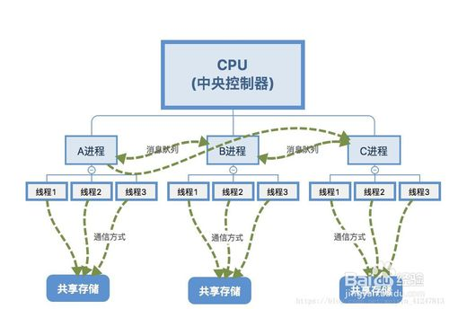

### 进程与线程的区别

#### 根本区别
> - 进程是资源分配最小单位，资源包含内存，硬盘等
>
> - 线程是程序执行的最小单位
>
> - 计算机在执行程序时，回味程序创建相应的进程，进行资源分配时，是以进程为单位进行相应的分配
>
> - 每个进程都有相应的线程，在执行程序时，实际上是执行相应的一系列进程
>
> 

#### 资源情况
> - 进程之间的资源是独立的
>
> - 同一进程内的线程共享本进程的资源
>
> 

#### CPU个数、核心数、线程数关系
> - CPU个数：是指物理上，即硬件上的核心数
>
> - 核心数：是指逻辑上，逻辑上模拟出的核心数
>
> - 线程数：同一时刻设备能并行执行的程序个数
>
>     线程数 = cpu个数 * 核数
>
> 多内核（multicore chips）是指在一枚处理器（CPU）中集成两个或zhi多个完整的计算引擎(内核)。
> 多核技术的开发源于工程师们认识到，仅仅提高单核芯片(one chip)的速度会产生过多热量且无法带来相应的性能改善，先前的处理器产品就是如此。
> 他们认识到，在先前产品中以那种速率，处理器产生的热量很快会超过太阳表面。即便是没有热量问题，其性价比也令人难以接受，速度稍快的处理器价格要高很多。

#### 并行和并发的概念
> - 并行：指两个或多个线程在同一时刻点发生，CPU同时执行
>
> - 并发：指两个或多个线程在同一时间段内发生，CPU交替执行

#### 时间片轮转机制（Round-Robin,RR）
> 根据先进先出原则，排成队列（就绪队列）
>
> 调度时，将CPU分配给队首进程，让其执行一个时间段（简称：时间片），时间片通常为10-100ms数量级
>
> 当执行的时间片用完时，会由计时器发出时钟中断请求，调度程序便据此来停止该进程的执行，并将它排到队列末尾
>
> 然后再把CPU重新分配给当前队列的队首进程，同理如此往返。

时间片大小取决于：
1、系统对响应时间的要求
2、就绪队列中的进程数目
3、系统的处理能力

#### 时间片轮转机实现思想
> 系统将所有的就绪进程按"先来先服务"算法的原则，排成一个队列，每次调度时，系统吧处理机分配给队首进程，并让其执行一个时间片；
>
> 当执行的时间片用完时，由一个计时器发出时钟中断请求，调度程序根据这个请求停止该进程的运行，将它动刀就绪队列的末尾；
>
> 再把处理机分给就绪队列中新的队列首进程，同时让它也执行一个时间片。

#### 线程调度
> - 抢占式线程调度
>
> 一个线程在执行自己的任务时，虽然任务还没有执行完，但是CPU会迫使它暂停，让其他线程占有CPU的使用权
>
> - 协作式线程调度
>
> 一个线程在执行自己的任务时，不允许被中途打断，一定等当前线程将任务执行完毕后才会释放对PCU的占有，其他线程才可以抢占该CPU
>
> - 对比
>
>    - 抢占式线程调度：不易发生饥饿现象，不易因为一个线程的问题而影响整个进程的执行，但是其频繁阻塞与调度，会造成系统资源的浪费
>
>    - 协作式线程调度：很容易因为一个线程的问题导致整个进程中其他线程饥饿