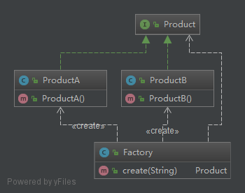
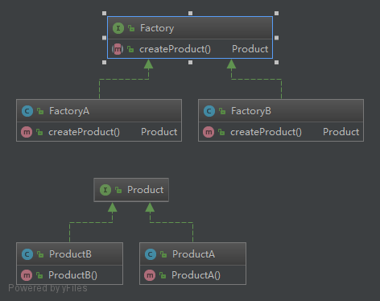
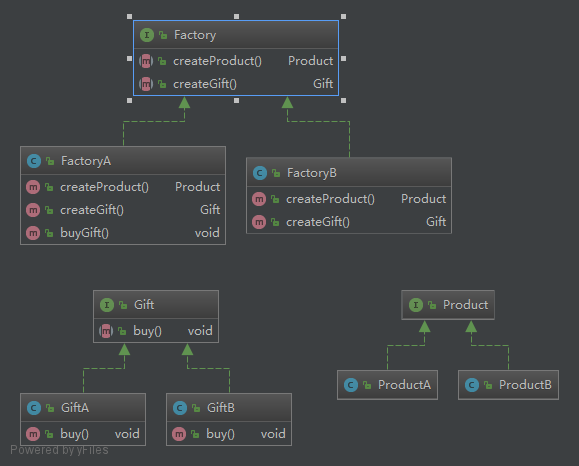

## 一、简单工厂
1.概念

简单工厂模式不是23种设计模式中的一个，实质上，它是根据传入的不同的参数创建不同的对象。

看一下类图，理解一下。


简单的demo

```java
public interface Product {

}

public class ProductA implements Product {
    public ProductA(){
        System.out.println("A");
    }

}

public class ProductB implements Product {
    public ProductB(){
        System.out.println("B");
    }

}

public class Factory {
    public Product create(String str) {
        //生成ProductA
        if (str.equalsIgnoreCase("A")) {
            return new ProductA();
        } else
            //生成ProductB
            if (str.equalsIgnoreCase("B")) {
                return new ProductB();
            }
        return null;
    }
    public static void main(String[] args) {
            Factory factory = new Factory();
            factory.create("A");
            factory.create("B");
        }

}

```
2.简单工厂的优缺点

（1）优点：实现对象的创建和对象的使用分离，将对象的创建交给专门的工厂类负责

（2）缺点：工厂类不够灵活，增加新的具体产品需要修改工厂类的判断逻辑代码，而且产品较多时，工厂方法代码将会非常复杂

3.适用场景
工厂类负责创建的对象比较少；客户端只知道传入工厂类的参数，对于如何创建对象不关心。

## 二、工厂方法模式
1.概念

工厂方法模式又称为工厂模式，也叫虚拟构造器（Virtual Constructor）模式或者多态工厂模式（Polymorphic Factory），在工厂方法模式中，父类负责定义创建对象的公共接口，而子类则负责生成具体的对象，这样做的目的是将类的实例化操作延迟到子类中完成，即由子类来决定究竟应该实例化（创建）哪一个类。

看一下类图，理解一下。


简单的demo

```java
public interface Factory {
    Product createProduct();
}
public class FactoryA implements Factory{
    @Override
    public Product createProduct() {
        return new ProductA();
    }
}
public class FactoryB implements Factory {
    @Override
    public Product createProduct() {
        return new ProductB();
    }
}

public class testFactory {
    public static void main(String[] args) {
        Factory a = new FactoryA();
        a.createProduct();
        Factory b = new FactoryB();
        b.createProduct();
    }
}

```
2.工厂方法拥有的角色。
- 抽象工厂角色
- 具体工厂角色
- 抽象产品角色
- 具体产品的角色

3.工厂方法的优缺点

（1）优点
 - 向客户隐藏了某种具体产品类的实现细节，用户只需要关心对应的工厂即可
 - 在系统中加入新产品时，无需修改顶层抽象工厂（无需修改客户端），只需要添加一个具体工厂就可以了，增强了系统的扩展性
 - 基于多态特性设计，可以抽象的创建某个产品对象

（2）缺点

在添加新产品时，需要编写新的具体产品类，而且还要提供与之对应的具体工厂类，系统中类的个数将成对增加，在一定程度上增加了系统的复杂度，有更多的类需要编译和运行，会给系统带来一些额外的开销。

4.适用场景

- 一个类不知道它所需要的对象的类
- 一个类通过其子类来指定创建哪个对象
- 将创建对象的任务委托给多个工厂子类中的某一个，客户端在使用时可以无须关心是哪一个工厂子类创建产品子类，需要时再动态指定。

5.工厂方法模式(Factory Method pattern)是最典型的模板方法模式(Template Method pattern)应用。

## 三、抽象工厂模式
1.概念

抽象工厂是对工厂方法的扩张，两者的区别在于工厂方法是针对于一个产品等级结构的，而抽象工厂是针对多个产品等级结构的。




```java

public  interface Factory {
    Product createProduct();
    Gift createFruit();
}

public interface Fruit {
}
public class FruitA implements Fruit {
    FruitA(){
        System.out.println("FruitA");
    }

}
public class FruitB implements Fruit {
    FruitB(){
        System.out.println("FruitB");
    }

}

public class testFactory {
    public static void main(String[] args) {
        Factory a = new FactoryA();
        a.createProduct();
        a.createFruit();
        Factory b = new FactoryB();
        b.createProduct();
        b.createFruit();
    }
}

```
3.抽象工厂拥有的角色。
- 抽象工厂角色
- 具体工厂角色
- 抽象产品角色
- 具体产品的角色

3.抽象工厂模式的优缺点

（1）优点

同工厂模式
当一个产品族中的多个对象被设计成一起工作时，它能够保证客户端始终只使用同一个产品族中的对象。

（2）缺点

同工厂模式

4.适用场景
- 一个系统不应当依赖于产品类实例如何被创建、组合和表达的细节，这对于所有类型的工厂模式都是重要的。 
- 系统中有多于一个的产品族，而每次只使用其中某一产品族。
- 属于同一个产品族的产品将在一起使用，这一约束必须在系统的设计中体现出来。
- 系统提供一个产品类的库，所有的产品以同样的接口出现，从而使客户端不依赖于具体实现。


