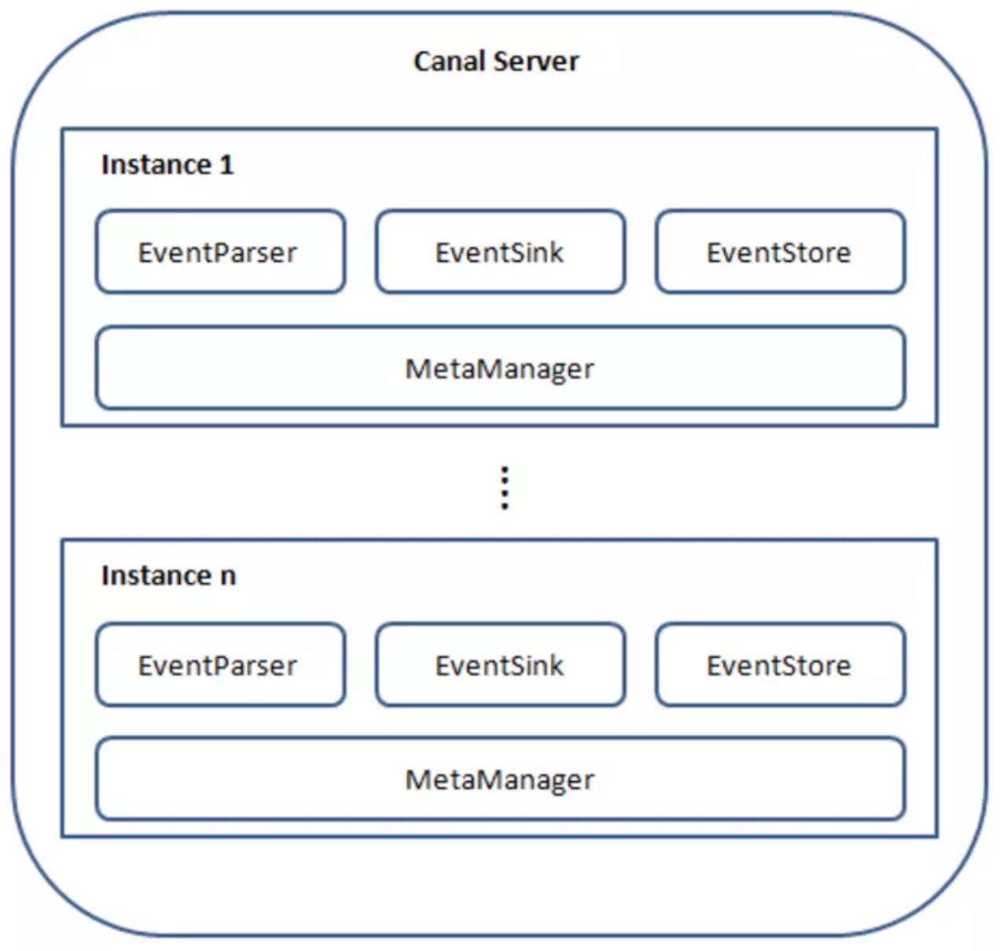
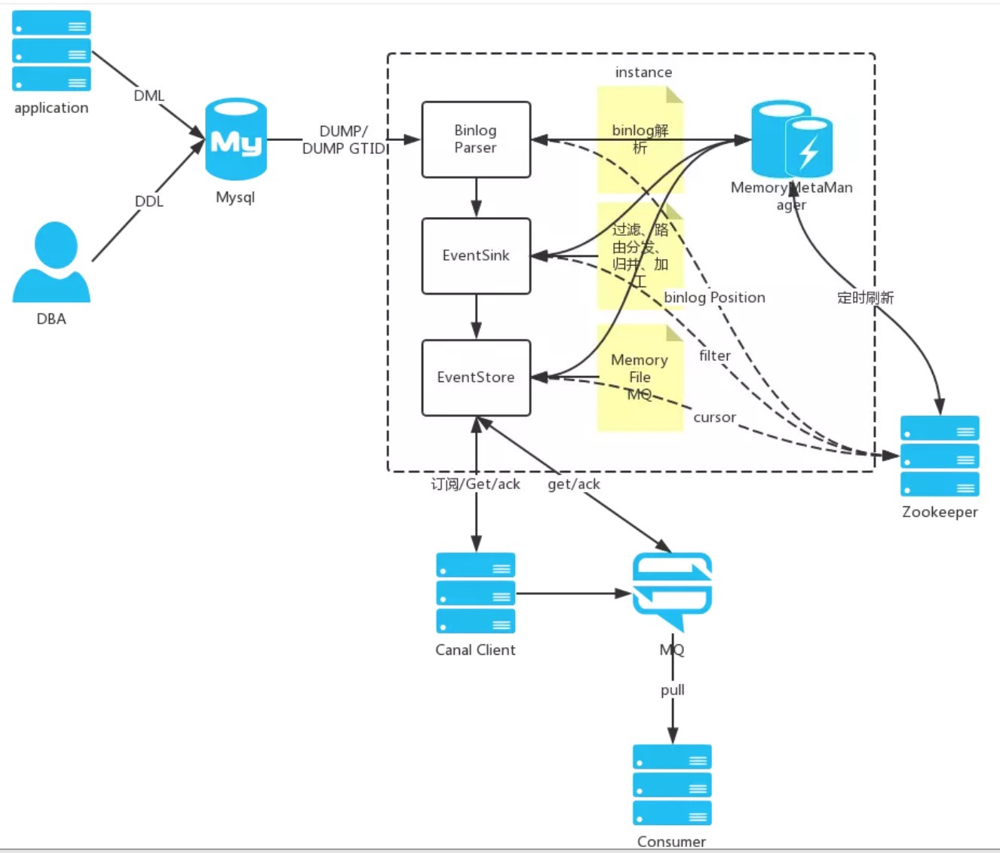

# canal源码分析 (五 ) eventStore的单线程模式

## 前言
#### 前言借用在网上看到的别人分享的非常好的canal整体架构图分析，这边借用一下



说明：

server代表一个canal运行实例，对应于一个jvm
instance对应于一个数据队列 （1个server对应1..n个instance)

instance模块：

eventParser (数据源接入，模拟slave协议和master进行交互，协议解析)
eventSink (Parser和Store链接器，进行数据过滤，加工，分发的工作)
eventStore (数据存储)
metaManager (增量订阅&消费信息管理器)
## 正文

#### 在上一篇文章中我们分析了一遍拉取数据的过程，留了一个问题，就是最后event会存在一个叫eventStore的地方，那里面到底是什么构造呢？本文就会看到这一块。
#### 在eventParser开始的时候，会有一个参数parallel进行选择是否并发。如果是，则选用MysqlMultiStageCoprocessor。会选用Disruptor
#### 否则用自带的mysqlConnection，会用到eventStore。本文先直接看到单线程的eventStore。也就是唯一的实现子类 MemoryEventStoreWithBuffer，里面会借用Disruptor的思想。

### 单线程模式
#### 回想一下上一章的最后内容，会调用eventStore的tryPut方法。我们也就从这个方法作为入口
```
    public boolean tryPut(List<Event> data) throws CanalStoreException {
    	// 做一些检查
        if (data == null || data.isEmpty()) {
            return true;
        }
		// 获得可重入锁
        final ReentrantLock lock = this.lock;
        lock.lock();
        try {
            if (!checkFreeSlotAt(putSequence.get() + data.size())) {
                return false;
            } else {
                doPut(data);
                return true;
            }
        } finally {
        	// 最后记得释放
            lock.unlock();
        }
    }
```
#### 整体代码逻辑看起来好像很简单，除了上面的注释内容之外，就是一个if-else的构造。先看到这个if条件，里面出现了一个叫putSequence的AtomicLong值。我们先看看这个值是干什么的
```
	// 底层存储结构就是这么一个数组结构，注意回想我之前说的，这里面会借用Disruptor的思想
	private Event[]           entries;
	
	// 类似Disruptor，也会有三个指针进行移动，检查是否可以放入就是依据这三个指标，初始值都是负一
    // 记录下put/get/ack操作的三个下标
    private AtomicLong        putSequence   = new AtomicLong(INIT_SEQUENCE);             // 代表当前put操作最后一次写操作发生的位置
    private AtomicLong        getSequence   = new AtomicLong(INIT_SEQUENCE);             // 代表当前get操作读取的最后一条的位置
    private AtomicLong        ackSequence   = new AtomicLong(INIT_SEQUENCE);             // 代表当前ack操作的最后一条的位置
```
#### 除了三个游标位点记录以外，内部还存储了三个指针操作的时间，已经改变的row行数，内存值大小。主要都是为了监控目前存储情况的，在后面会讲到，现在回到刚才的方法
```
	(!checkFreeSlotAt(putSequence.get() + data.size()))
```
#### 看名字也可以看出就是检查一下是否还有空位存储新来的数据
```
	/**
     * 查询是否有空位, 传入的是目前put的位点 + 可能会放入的所有data的大小
    */
    private boolean checkFreeSlotAt(final long sequence) {
    	// buffersize就是底层数据的大小，假设此时size = 16， 传入put位点为20
    	// 则将数组看成一个圆的话，也就是绕了一圈，回到了4的位置
        final long wrapPoint = sequence - bufferSize;
        // 得到目前get位点和ack位点的较小值
        // 看似不可能存在已ack但未get的值，但要注意套圈的情况
        final long minPoint = getMinimumGetOrAck();
        // 如果大于，则代表加上新传入的值的话，已经会覆盖未get或未ack的值，这显然是不对的
        if (wrapPoint > minPoint) { // 刚好追上一轮
            return false;
        } else {
            // 此时已经可以满足位点的需求，但是如果是Mem模式的话，还需要检查占内存的大小
            if (batchMode.isMemSize()) {
            		// 之前提过，除了put get ack三个操作的位点外，还会记录占用的内存值
            		// 此时计算put的总内存 - 已ack的总内存
            		// 即目前剩余在底层数组中的所有内存大小
                final long memsize = putMemSize.get() - ackMemSize.get();
                // 默认阈值大小为16M
                if (memsize < bufferSize * bufferMemUnit) {
                    return true;
                } else {
                    return false;
                }
            } else {
            		// 如果不是Mem模式，则可以直接返回true，代表可以放入
                return true;
            }
        }
    }
```
#### 上述分析了一下是否可以存储的判断过程，如果确认不能放入，则直接返回false，如果确认了可以放入。则继续执行doPut方法
```
	private void doPut(List<Event> data) {
		// 获取当前put的位点
        long current = putSequence.get();
        // 计算将data放入后的结束位点
        long end = current + data.size();

        // 先写数据，再更新对应的cursor,并发度高的情况，putSequence会被get请求可见，拿出了ringbuffer中的老的Entry值
        for (long next = current + 1; next <= end; next++) {
            entries[getIndex(next)] = data.get((int) (next - current - 1));
        }
		// 记录位点信息
        putSequence.set(end);

        // 记录一下gets memsize信息，方便快速检索
        if (batchMode.isMemSize()) {
            long size = 0;
            for (Event event : data) {
                size += calculateSize(event);
            }

            putMemSize.getAndAdd(size);
        }
        profiling(data, OP.PUT);
        // tell other threads that store is not empty
        notEmpty.signal();
    }
```
#### 以上就是put的过程，主要是维护好put位点。现在我们看一下get的过程。看到tryGet方法。
```
	// 会传入一个位点，以及想要获取多少数据
    public Events<Event> tryGet(Position start, int batchSize) throws CanalStoreException {
        final ReentrantLock lock = this.lock;
        lock.lock();
        try {
            return doGet(start, batchSize);
        } finally {
            lock.unlock();
        }
    }
```
#### 同样的加锁行为，注意看到入参中的position参数，这个参数会从CanalServerWithEmbedded中获得。这边不细说了直接看到doGet方法。
```
	private Events<Event> doGet(Position start, int batchSize) throws CanalStoreException {
        LogPosition startPosition = (LogPosition) start;

        long current = getSequence.get();
        long maxAbleSequence = putSequence.get();
        long next = current;
        long end = current;
        // 如果startPosition为null，说明是第一次，默认+1处理
        if (startPosition == null || !startPosition.getPostion().isIncluded()) { // 第一次订阅之后，需要包含一下start位置，防止丢失第一条记录
            next = next + 1;
        }

        if (current >= maxAbleSequence) {
            return new Events<Event>();
        }
        ...
    }
```
#### 上述都是简单的处理，直接看到下面的重点
```
	if (batchMode.isItemSize()) {
		// 计算能得到的最大的结束位点
        end = (next + batchSize - 1) < maxAbleSequence ? (next + batchSize - 1) : maxAbleSequence;
        // 提取数据并返回
        for (; next <= end; next++) {
        	// 得到对应的event
            Event event = entries[getIndex(next)];
            // 是否过滤ddl的操作
            if (ddlIsolation && isDdl(event.getEventType())) {
                // 如果是ddl隔离，直接返回
                if (entrys.size() == 0) {
                    entrys.add(event);// 如果没有DML事件，加入当前的DDL事件
                    end = next; // 更新end为当前
                } else {
                    // 如果之前已经有DML事件，直接返回了，因为不包含当前next这记录，需要回退一个位置
                    end = next - 1; // next-1一定大于current，不需要判断
                }
                break;
            } else {
                entrys.add(event);
            }
        }
    }else {
   			// Mem模式，跟上面类似 
            long maxMemSize = batchSize * bufferMemUnit;
            for (; memsize <= maxMemSize && next <= maxAbleSequence; next++) {
                // 永远保证可以取出第一条的记录，避免死锁
                Event event = entries[getIndex(next)];
                if (ddlIsolation && isDdl(event.getEventType())) {
                    // 如果是ddl隔离，直接返回
                    if (entrys.size() == 0) {
                        entrys.add(event);// 如果没有DML事件，加入当前的DDL事件
                        end = next; // 更新end为当前
                    } else {
                        // 如果之前已经有DML事件，直接返回了，因为不包含当前next这记录，需要回退一个位置
                        end = next - 1; // next-1一定大于current，不需要判断
                    }
                    break;
                } else {
                    entrys.add(event);
                    memsize += calculateSize(event);
                    end = next;// 记录end位点
                }
            }

    }
```
#### 以上就得到了一组需要的entrys。
```
	PositionRange<LogPosition> range = new PositionRange<LogPosition>();
        result.setPositionRange(range);

        range.setStart(CanalEventUtils.createPosition(entrys.get(0)));
        range.setEnd(CanalEventUtils.createPosition(entrys.get(result.getEvents().size() - 1)));
        // 记录一下是否存在可以被ack的点

        for (int i = entrys.size() - 1; i >= 0; i--) {
            Event event = entrys.get(i);
            // GTID模式,ack的位点必须是事务结尾,因为下一次订阅的时候mysql会发送这个gtid之后的next,如果在事务头就记录了会丢这最后一个事务
            if ((CanalEntry.EntryType.TRANSACTIONBEGIN == event.getEntryType() && StringUtils.isEmpty(event.getGtid()))
                || CanalEntry.EntryType.TRANSACTIONEND == event.getEntryType() || isDdl(event.getEventType())) {
                // 将事务头/尾设置可被为ack的点
                range.setAck(CanalEventUtils.createPosition(event));
                break;
            }
        }
```
#### 然后会选择一个event作为被ack的标记点。这个在后面的ack方法中会讲到。在得到events之后，会在zk上记录一个对应客户端的batchId，一个递增的序号，作为之后ack的凭证
#### 客户端成功收到信息后，会在调用ack方法，进行确认。注意一个细节，因为之前在发送Msg给客户端的时候，在zk上存了一份msgId和对应的position。所以在客户端ack的时候，canal会先查询zk上是否存在对应的msgid，如果存在则先移除zk上的节点，再进行ack操作，否则则代表是重复的ack操作，直接抛出异常。
```
 	public void ack(Position position) throws CanalStoreException {
        cleanUntil(position);
    }
    
    public void cleanUntil(Position position) throws CanalStoreException {
        final ReentrantLock lock = this.lock;
        lock.lock();
        try {
            long sequence = ackSequence.get();
            long maxSequence = getSequence.get();

            boolean hasMatch = false;
            long memsize = 0;
            // ack没有list，但有已存在的foreach，还是节省一下list的开销
            long localExecTime = 0L;
            int deltaRows = 0;
            for (long next = sequence + 1; next <= maxSequence; next++) {
                Event event = entries[getIndex(next)];
                if (localExecTime == 0 && event.getExecuteTime() > 0) {
                    localExecTime = event.getExecuteTime();
                }
                deltaRows += event.getRowsCount();
                memsize += calculateSize(event);
                // 比对position的执行时间，journalName和position
                boolean match = CanalEventUtils.checkPosition(event, (LogPosition) position);
                if (match) {// 找到对应的position，更新ack seq
                    hasMatch = true;
						
                    if (batchMode.isMemSize()) {
                        ackMemSize.addAndGet(memsize);
                        // 尝试清空buffer中的内存，将ack之前的内存全部释放掉
                        for (long index = sequence + 1; index < next; index++) {
                            entries[getIndex(index)] = null;// 设置为null
                        }
                    }

                    if (ackSequence.compareAndSet(sequence, next)) {// 避免并发ack
                        notFull.signal();
                        ackTableRows.addAndGet(deltaRows);
                        if (localExecTime > 0) {
                            ackExecTime.lazySet(localExecTime);
                        }
                        return;
                    }
                }
            }
            if (!hasMatch) {// 找不到对应需要ack的position
                throw new CanalStoreException("no match ack position" + position.toString());
            }
        } finally {
            lock.unlock();
        }
    }
```
#### 根据给定的position，去精确匹配对应的event的位点，如果找到，则ack前面的所有event。
#### 再简单过一遍rollback的逻辑。
```
	public void rollback() throws CanalStoreException {
        final ReentrantLock lock = this.lock;
        lock.lock();
        try {
            getSequence.set(ackSequence.get());
            getMemSize.set(ackMemSize.get());
        } finally {
            lock.unlock();
        }
    }
```
#### 就是很简单的移动游标。以上就简单过了一下单线程情况。现在看看多线程情况。
#### 为了篇幅问题，多线程模式放在下一章中。因为还需要详细说一下Disruptor。所以篇幅会比较长
