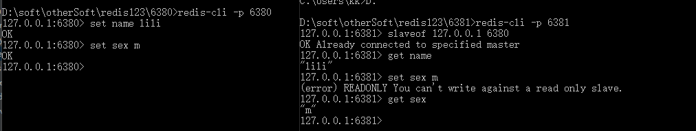
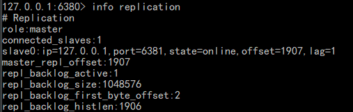
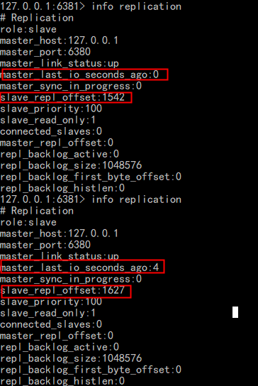
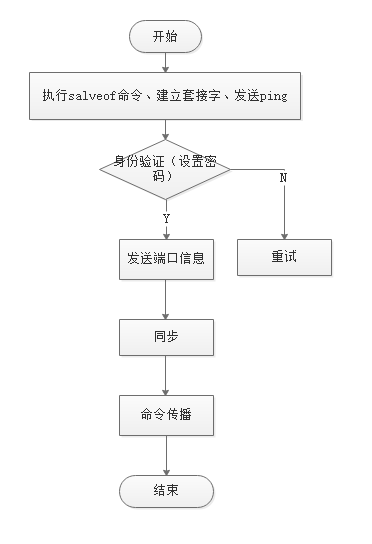
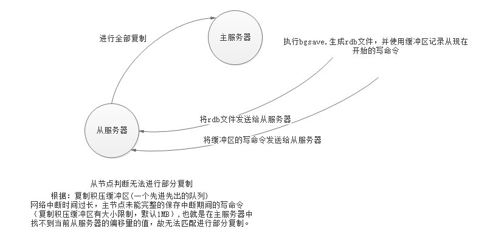

#### Redis之主从复制

**一、主从复制的简单搭建（基于Windows）**

主服务器主要负责写操作，从服务器只负责读
1、一主一从：两个redis的Windows版本

2、修改配置文件redis.windows.conf（端口号port改为：6380(主)/6381(从)、从服务器配置（slaveof 127.0.0.1 6380））

3、使用命令安装redis服务（redis-server --service-install redis.windows.conf --service-name redis6380）

4、连接两个redis服务器(redis-cli -p [port])

简单命令操作如下图：

一主一从：主服务器主要负责写，从服务器只负责读

主服务器复制的相关信息

从服务器复制的相关信息

**二、主从复制**

复制的流程图：

1、Redis2.8以前

   同步：将从服务器的数据库状态更新到主服务器当前所属的状态

    从服务器向主服务器发送SYNC命令，执行BGSAVE命令，生成rdb文件，将从现在开始的写命令存入一个缓冲区；
    BGSAVE执行完，主服务器将生成的rdb文件发给从服务器，从同步这个rdb文件

存在的问题:
- 断线后，重新连接进行全部复制，SYNC命令非常消耗资源
   
2、Redis2.8以后

使用PSYNC命令代替SYNC命令。

  实现方式：
    
    若为第一次进行复制则该命令与SYNC基本一致，
    若为连接中断重连时，从服务器将储存的runId发送给主服务器进行匹配，匹配得上， 
    主服务器根据偏移量offset+1是否在复制积压缓冲区内进行判断下一步的操作。
    在，则使用部分复制，否则使用完全复制
    
   这里有一个图来理解一下：
   

有下面三个结构：

（1）偏移量（offset）：用来标志主从不一致的“位置”

    主服务器的复制偏移量（主服务器每次向从服务器传播N个字节的数据时，就在自己的复制偏移量上+N）
    从服务器的复制偏移量（从服务器每收到主服务器传播N个字节的数据时，就在自己的复制偏移量上+N）
    
（2）主服务器的复制积压缓冲区：命令传播时，将写命令入队到复制积压缓冲区

    固定长的先进先出队列：保存着一部分最近传播的写操作
    结构：偏移量+字节值
    默认大小1MB(repl-blacklog-size的设置大小)
    
（3）服务器运行的ID（做标志）

    初次复制时（主服务器会将自己的runId发给从服务器，保存下来）
    部分复制（网络中断重连时，从服务器将储存的runId发送给主服务器进行匹配，匹配得上，此时具有部分同步的机会）
 
3、命令传播：主服务器状态被修改导致主从状态不一致时，让主从服务器重回一致状态
  
    生成rdb文件后，将从现在开始的所有写命令放入缓冲区中，主将缓冲区中的命令发送给从服务器，从服务器再更新自己数据库的状态。
    
4、心跳检测

 在Redis2.8添加的功能，在命令传播阶段，从服务器会议每秒一次的频率向主服务器发送命令（REPLCONF ACK <replcation_offset>），replcation_offset就是从服务器的复制偏移量。心跳检测的几个作用：

- 检测主从服务器的网络连接状态
- 辅助实现min-slaves选项
- 检测命令丢失(这里就是根据偏移量来判断)

**三、小结**
  

   
