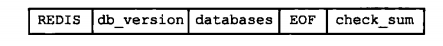
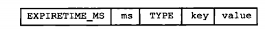
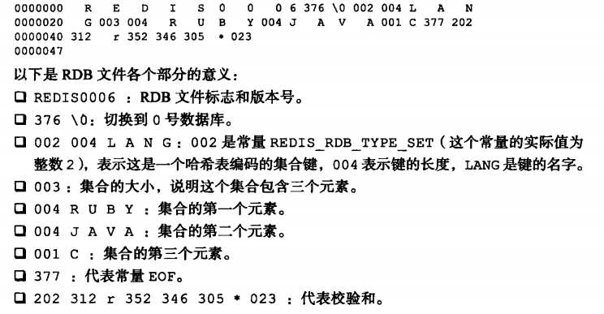

### Redis的两种持久化

redis持久化的两种方式RDB、AOF
- 为什么要数据持久化
- 持久化的两种方式是什么
- redis实现持久化的操作
- 两种持久化的优劣

由于Redis的数据都存放在内存中，如果没有配置持久化，redis重启后数据就全丢失了，于是需要开启redis的持久化功能，将数据保存到磁盘上，当redis重启后，可以从磁盘中恢复数据。redis提供两种方式进行持久化，一种是RDB持久化（原理是将Reids在内存中的数据库记录定时dump到磁盘上的RDB持久化），另外一种是AOF（append only file）持久化（原理是将Reids的操作日志以追加的方式写入文件）。

### 一、RDB持久化
1.定义

RDB持久化是指在指定的时间间隔内将内存中的数据集快照写入磁盘，实际操作过程是fork一个子进程，先将数据集写入临时文件，写入成功后，再替换之前的文件，用二进制压缩存储，生成rdb文件。

rdb文件在载入时，会一直处于阻塞状态，知道载入完成。

在redis的配置文件中有这么个配置：
``` 
save 900 1      //在90秒内有1次修改
save 300 10     //在300秒内有10次修改
save 60 10000
```

2.主要的命令
 save/bgSave
 
| 命令 | 小区别 |
| :------: | :------: |
| save|该命令执行时会阻塞其他客户端的请求，一直等该命令执行完才可以执行其他命令|
| bgsave|会fork一个子进程来执行，该命令执行时会拒绝save请求，避免产生竞争;若是bgrewriteaof请求,则延迟到bgsave之后执行|
| bgrewriteaof|该命令执行时，会拒绝bgsave请求|

3.rdb文件的结构
rdb文件是一个经过压缩的二进制文件，由多个部分组成，对于不同类型的键值对，rdb文件会使用不同的方式来存储，如下图所示。



- REDIS:5字节，标志这是一个redis的rdb文件
- db_version:4字节，记录rdb文件的版本号
- EOF:1字节，一个常量，标志着rdb文件的正文结束
- databases:正文部分
- check_num:8字节，无符号整数，保存一个校验和

databases结构：


- selectedb:1字节，标志下一个读入的就是数据库的号码
- db_number:数据库号码
- key_value_pairs:键值对

key_value_pairs结构：



一个具体的rdb文件解析：



 4.我们来看看bgSave的源码：

bgSave命令
``` 
/* BGSAVE [SCHEDULE] */
void bgsaveCommand(client *c) {
    int schedule = 0;
    /* The SCHEDULE option changes the behavior of BGSAVE when an AOF rewrite
     * is in progress. Instead of returning an error a BGSAVE gets scheduled. */
     //当AOF重写时，schedule选项更改正在进行中bgsave的行为,而不是返回一个错误，一个bgsave被调度。
    if (c->argc > 1) {
        if (c->argc == 2 && !strcasecmp(c->argv[1]->ptr,"schedule")) {
            schedule = 1;
        } else {
            addReply(c,shared.syntaxerr);
            return;
        }
    }
    rdbSaveInfo rsi, *rsiptr;
    rsiptr = rdbPopulateSaveInfo(&rsi);
    if (server.rdb_child_pid != -1) {
        addReplyError(c,"Background save already in progress");
    } else if (server.aof_child_pid != -1) {
        if (schedule) {
            server.rdb_bgsave_scheduled = 1;
            addReplyStatus(c,"Background saving scheduled");
        } else {
            addReplyError(c,
                "An AOF log rewriting in progress: can't BGSAVE right now. "
                "Use BGSAVE SCHEDULE in order to schedule a BGSAVE whenever "
                "possible.");
        }
    } else if (rdbSaveBackground(server.rdb_filename,rsiptr) == C_OK) {
        addReplyStatus(c,"Background saving started");
    } else {
        addReply(c,shared.err);
    }
}
int rdbSaveBackground(char *filename, rdbSaveInfo *rsi) {
    pid_t childpid;
    long long start;
    if (server.aof_child_pid != -1 || server.rdb_child_pid != -1) return C_ERR;
    server.dirty_before_bgsave = server.dirty;
    server.lastbgsave_try = time(NULL);
    openChildInfoPipe();
    start = ustime();
    if ((childpid = fork()) == 0) {
        int retval;
        /* Child */
        closeListeningSockets(0);
        redisSetProcTitle("redis-rdb-bgsave");
        retval = rdbSave(filename,rsi);
        if (retval == C_OK) {
            size_t private_dirty = zmalloc_get_private_dirty(-1);
            if (private_dirty) {
                serverLog(LL_NOTICE,
                    "RDB: %zu MB of memory used by copy-on-write",
                    private_dirty/(1024*1024));
            }
            server.child_info_data.cow_size = private_dirty;
            sendChildInfo(CHILD_INFO_TYPE_RDB);
        }
        exitFromChild((retval == C_OK) ? 0 : 1);
    } else {
        /* Parent */
        server.stat_fork_time = ustime()-start;
        server.stat_fork_rate = (double) zmalloc_used_memory() * 1000000 / server.stat_fork_time / (1024*1024*1024); /* GB per second. */
        latencyAddSampleIfNeeded("fork",server.stat_fork_time/1000);
        if (childpid == -1) {
            closeChildInfoPipe();
            server.lastbgsave_status = C_ERR;
            serverLog(LL_WARNING,"Can't save in background: fork: %s",
                strerror(errno));
            return C_ERR;
        }
        serverLog(LL_NOTICE,"Background saving started by pid %d",childpid);
        server.rdb_save_time_start = time(NULL);
        server.rdb_child_pid = childpid;
        server.rdb_child_type = RDB_CHILD_TYPE_DISK;
        updateDictResizePolicy();
        return C_OK;
    }
    return C_OK; /* unreached */
}
 ```
 ### 二、AOF持久化
 1.定义
 
 AOF持久化以日志的形式记录服务器所处理的每一个写、删除操作，查询操作不会记录，以文本的方式记录，可以打开文件看到详细的操作记录。当aof持久化功能打开时，会将被执行的写命令追加到服务器状态的aof_buf缓冲区的末尾。
 
 2.AOF的实现
 - 命令追加
 - 文件写入
 - 文件同步
 
``` 
 
 /* Append only defines */
 #define AOF_FSYNC_NO 0
 #define AOF_FSYNC_ALWAYS 1
 #define AOF_FSYNC_EVERYSEC 2
 #define REDIS_DEFAULT_AOF_FSYNC AOF_FSYNC_EVERYSEC
```
 
 
 