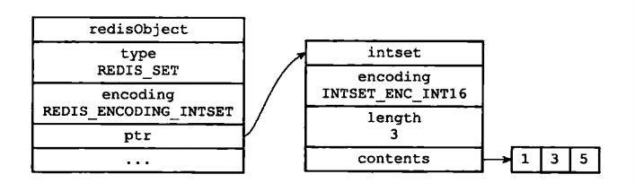

**一、set的底层实现有两种**
- intset：Hash对象只有同时满足下面两个条件时，才会使用intset（整数集合）：（1）集合对象中所有元素都是整数（2）集合对象所有元素数量不超过512（第二个条件可以通过配置文件的 set-max-intset-entries 进行配置）
- hashtable：不满足上述条件时

**1、intset**

结构图示：

(1)结构

    typedef struct intset {
        uint32_t encoding;    //编码方式
        uint32_t length;    //集合元素数量
        int8_t contents[];    //保存元素的数组
    } intset;
    
    1. encoding：表示整数的编码方式，可选项为INTSET_ENC_INT16、INTSET_ENC_INT32和INTSET_ENC_INT64
    2. length：集合包含的元素数量
    3. contents[]：保存实际元素的数组，数组中元素是有序的。
    
(2)升级操作（扩容）

- 为什么要升级？

添加的元素类型比现有的都要长，在整数集合中存不下了

- 升级的操作
  
根据新添加的元素的类型扩展底层数组的大小，分配新空间；
将底层所有的元素格式替换成和新元素一致的类型，同时保持有序性；
将新元素添加进数组中    

不支持降级

这篇文章比较详细了（https://www.jianshu.com/p/40d2ba7eb9be）

**2、hashtable**

为什么使用hashtable存储？
 使用intset是为了节约内存，存储整数，如果超过一定的数量的值再用intset存储就达不到那个效果了，hashtable可以存储不同类型的值
 
 和java中的HashSet相似，在redis中，set集合使用hashtable中的key来存储值，value值被设置成null
 
 (1)结构
 
 结构示意图：
  
  
   
 (2)扩容操作（rehash过程）
 - 有两个hash表
 - 渐进式rehash
 
  参考本系列文章的字典篇