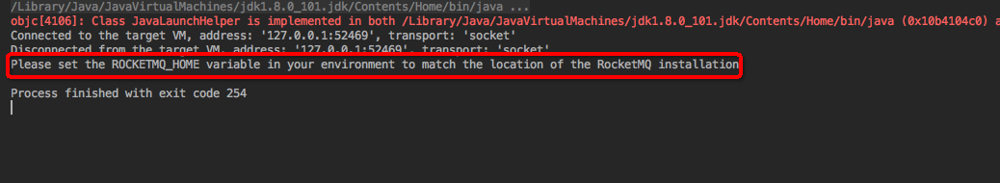

### 1、使用命令启动
下载 source release[获取资源](https://www.apache.org/dyn/closer.cgi?path=rocketmq/4.3.2/rocketmq-all-4.3.2-source-release.zip)
或者说通过github 下载源码：[GitHub](https://github.com/apache/rocketmq/)

上面的操作完成后通过命令启动服务：

Server start and stop

1、build 
```
> cd rocketmq-all-4.3.2/
> mvn -Prelease-all -DskipTests clean install -U
> cd distribution/target/apache-rocketmq
```


2、Start Name Server
```
> nohup sh bin/mqnamesrv &
> tail -f ~/logs/rocketmqlogs/namesrv.log
  The Name Server boot success...  
``` 

3、Start Broker
```
> nohup sh bin/mqbroker -n localhost:9876 &
> tail -f ~/logs/rocketmqlogs/broker.log 
  The broker[%s, 172.30.30.233:10911] boot success...
```

4、Send & Receive Messages
```
> export NAMESRV_ADDR=localhost:9876
> sh bin/tools.sh org.apache.rocketmq.example.quickstart.Producer
  SendResult [sendStatus=SEND_OK, msgId= ...

> sh bin/tools.sh org.apache.rocketmq.example.quickstart.Consumer
  ConsumeMessageThread_%d Receive New Messages: [MessageExt...
```

5、Shutdown Servers
```
> sh bin/mqshutdown broker
  The mqbroker(36695) is running...
  Send shutdown request to mqbroker(36695) OK

> sh bin/mqshutdown namesrv
  The mqnamesrv(36664) is running...
  Send shutdown request to mqnamesrv(36664) OK
```

### 2、源码启动

源码下载后，我们根据官方文档知道，先要启动namesrv，之后再启动broker


查看脚本内容：

```
if [ -z "$ROCKETMQ_HOME" ] ; then
  ## resolve links - $0 may be a link to maven's home
  PRG="$0"

  # need this for relative symlinks
  while [ -h "$PRG" ] ; do
    ls=`ls -ld "$PRG"`
    link=`expr "$ls" : '.*-> \(.*\)$'`
    if expr "$link" : '/.*' > /dev/null; then
      PRG="$link"
    else
      PRG="`dirname "$PRG"`/$link"
    fi
  done

  saveddir=`pwd`

  ROCKETMQ_HOME=`dirname "$PRG"`/..

  # make it fully qualified
  ROCKETMQ_HOME=`cd "$ROCKETMQ_HOME" && pwd`

  cd "$saveddir"
fi

export ROCKETMQ_HOME

sh ${ROCKETMQ_HOME}/bin/runserver.sh org.apache.rocketmq.namesrv.NamesrvStartup $@
```

```
if [ -z "$ROCKETMQ_HOME" ] ; then
  ## resolve links - $0 may be a link to maven's home
  PRG="$0"

  # need this for relative symlinks
  while [ -h "$PRG" ] ; do
    ls=`ls -ld "$PRG"`
    link=`expr "$ls" : '.*-> \(.*\)$'`
    if expr "$link" : '/.*' > /dev/null; then
      PRG="$link"
    else
      PRG="`dirname "$PRG"`/$link"
    fi
  done

  saveddir=`pwd`

  ROCKETMQ_HOME=`dirname "$PRG"`/..

  # make it fully qualified
  ROCKETMQ_HOME=`cd "$ROCKETMQ_HOME" && pwd`

  cd "$saveddir"
fi

export ROCKETMQ_HOME

sh ${ROCKETMQ_HOME}/bin/runbroker.sh org.apache.rocketmq.broker.BrokerStartup $@
```

2、1首先启动 namesrv
会出现以下错误：



同理 broker 启动的时候也会出现上面类似的错误

2、2解决方法：
org.apache.rocketmq.namesrv.NamesrvStartup 设置：
namesrvConfig.setRocketmqHome("/Users/alvin/enuo/sourcecode/rocketmq/distribution");

org.apache.rocketmq.broker.BrokerStartup 设置：
brokerConfig.setRocketmqHome("/Users/alvin/enuo/sourcecode/rocketmq/distribution");
            brokerConfig.setNamesrvAddr("localhost:9876");
            
Producer 和 Consumer 的启动 注意分别添加：

producer.setNamesrvAddr("localhost:9876");
consumer.setNamesrvAddr("localhost:9876");


[RocketMQ Document](https://rocketmq.apache.org/docs/quick-start/)
[RocketMQ源码调试:服务启动](https://juejin.im/entry/5ad0d89751882555677efaa5)
[RocketMQ源码阅读Debug环境构建](https://www.jianshu.com/p/ad9764022e8a)

